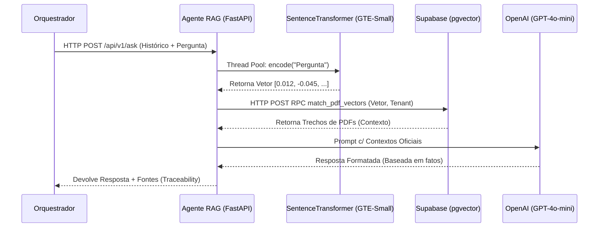

# MindDesk - Agente RAG (Retrieval-Augmented Generation)

Este microserviço em Python (FastAPI) atua como o **Bibliotecário Especialista** do ecossistema MindDesk.

A sua responsabilidade exclusiva é realizar buscas semânticas vetoriais dentro dos documentos institucionais da empresa (manuais, políticas, cartilhas) utilizando a arquitetura RAG. Ele processa a linguagem natural do usuário, transforma em vetores numéricos e utiliza a Inteligência Artificial para redigir respostas baseadas unicamente em fontes oficiais, evitando alucinações.

---

## Posição no Ecossistema MindDesk

O Agente RAG entra em cena quando o Roteador Semântico determina que o usuário está buscando por regras, manuais ou informações qualitativas que residem nos arquivos em PDF da empresa.



---

## Arquitetura e Fluxo de Dados (SRP)

O microserviço foi segmentado para isolar as três naturezas de processamento distintas do fluxo RAG (Cálculo Matemático, I/O de Banco e Processamento LLM).

```text
/app
├── main.py                 # Ponto de entrada ASGI da aplicação
├── core/
│   └── schemas.py          # Declaração estrita dos contratos de entrada e saída
├── api/
│   └── routes.py           # Controller (Pipelines: Embed -> Search -> Generate)
└── services/
    ├── embedding_service.py # Modelagem Numérica CPU-Bound (Thread Isolada)
    ├── db_service.py        # I/O Assíncrono com a API REST do Supabase
    └── llm_service.py       # Extração e Sintetização Contextual (OpenAI)
```

---

##  Detalhamento de Módulos e Funções

### 1. Motor de Similaridade (`app/services/embedding_service.py`)
Carrega o modelo de IA **GTE-Small** em memória na inicialização do servidor. 
* **Design de Concorrência:** Como a geração do embedding vetorial é uma tarefa intensiva em CPU (CPU-bound), a função `gerar_embedding` executa através do método `run_in_executor` do `asyncio`. Isso garante que as equações matemáticas não bloqueiem o Event Loop, permitindo que o FastAPI responda a outros usuários em paralelo.

### 2. Barramento de Busca Vetorial (`app/services/db_service.py`)
Substituiu o driver nativo do Supabase por invocações HTTP REST nativas (`httpx`). 
Ele chama a função RPC (Remote Procedure Call) `match_pdf_vectors` no banco de dados, enviando o vetor gerado, o grau de precisão mínimo (`match_threshold`) e o filtro de segurança de `tenant_id`, recebendo apenas chunks altamente relevantes.

### 3. Motor de Sintetização (`app/services/llm_service.py`)
Utiliza um "System Prompt" agressivo com amarras anti-alucinação. Ele compila a fofoca (histórico recente do chat) e os parágrafos recuperados do banco, instruindo a OpenAI a responder *apenas* com os dados ali presentes. Se os dados não estiverem lá, ele é programado para admitir desconhecimento em vez de inventar uma política.

---

##  Escalabilidade e Manutenção

1. **Eficiência de Boot:** O modelo de Embedding pesa aproximadamente 120MB. O `Dockerfile` realiza o pre-download deste modelo no momento da construção da imagem, zerando latências e instabilidades de rede durante o scale-out dos containers em produção.
2. **Rastreabilidade (Traceability):** O serviço sempre retorna as `sources` (ID do PDF e grau de semelhança matemática), permitindo que o Front-End eventualmente exiba um botão "Ler Documento Original" para o usuário final.
3. **Paridade Arquitetural:** O serviço partilha o exato mesmo modelo de design, DTOs e bibliotecas que os outros microsserviços do ecossistema, facilitando a troca e treinamento entre desenvolvedores na Squad.