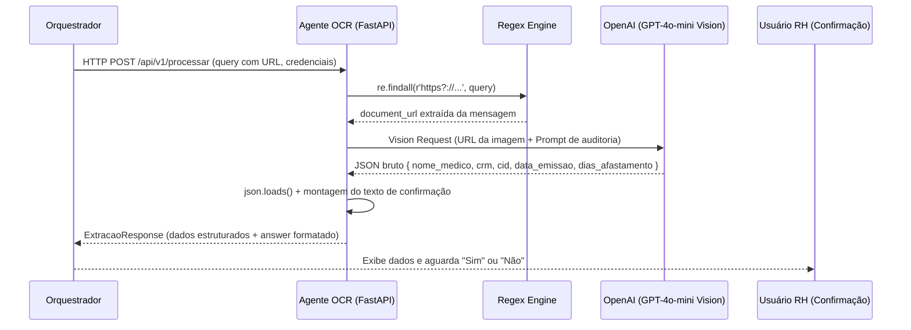

# MindDesk - Agente de Documentos e OCR

Este microserviço em Python (FastAPI) atua como o **Auditor Visual** do ecossistema MindDesk.

A sua responsabilidade exclusiva é analisar imagens de atestados médicos enviadas via URL, extraindo estruturalmente os dados clínicos e administrativos do documento (médico, CRM, CID, data de emissão e dias de afastamento) utilizando a visão computacional do modelo GPT-4o-mini. Ele transforma um documento visual não estruturado em um objeto de dados validado, pronto para ser persistido ou auditado pelo RH.

---

## Posição no Ecossistema MindDesk

O Agente OCR é acionado pelo Orquestrador quando o Roteador Semântico identifica que o usuário está submetendo um documento médico para extração. Ele recebe a mensagem bruta do usuário (que contém uma URL embutida), extrai o link via Regex, e devolve ao Orquestrador tanto os dados estruturados quanto um texto formatado para exibição no chat — aguardando confirmação humana antes de qualquer persistência.



---

## Arquitetura e Fluxo de Dados (SRP)

O microserviço segrega as responsabilidades em três camadas distintas: o contrato de dados, o controller de rota e o serviço de inteligência visual. A lógica de extração reside inteiramente em `ocr_service.py`, mantendo a rota agnóstica à implementação.

```text
/app
├── main.py                 # Ponto de entrada ASGI da aplicação
├── core/
│   └── schemas.py          # Contratos de entrada (DocumentPayload) e saída (ExtracaoResponse)
├── api/
│   └── routes.py           # Controller: validação de entrada e delegação ao serviço
└── services/
    └── ocr_service.py      # Extração visual via GPT-4o-mini (URL parsing + Vision + JSON)
```

---

## Detalhamento de Módulos e Funções

### 1. Contratos de Dados (`core/schemas.py`)

O `DocumentPayload` adota o campo `query` (em vez de `document_url`) para manter paridade com o padrão de entrada do Orquestrador — que sempre encaminha a mensagem bruta do usuário. A URL do documento vive dentro desse texto e é extraída em tempo de execução pelo serviço.

```python
class DocumentPayload(BaseModel):
    query: str           # Mensagem do usuário (contém a URL do atestado embutida)
    tenant_id: int
    user_id: str = "N/A"
    openai_api_key: str
    supabase_url: str
    supabase_key: str
    history: List = []
```

O `ExtracaoResponse` espelha esse contrato no retorno: combina os campos estruturados da auditoria médica com o campo `answer` — o texto formatado para exibição direta no chat, no mesmo padrão de resposta lido pelo Orquestrador.

```python
class ExtracaoResponse(BaseModel):
    sucesso: bool
    nome_medico: Optional[str] = None
    crm: Optional[str] = None
    cid: Optional[str] = None
    data_emissao: Optional[str] = None
    dias_afastamento: Optional[int] = None
    answer: str   # Texto formatado para exibição no chat (lido pelo Orquestrador)
```

### 2. Controller de Rota (`api/routes.py`)

A rota executa exclusivamente a validação de guarda: rejeita requisições sem chave da OpenAI antes de qualquer processamento e delega integralmente ao serviço de OCR. Nenhuma lógica de negócio reside aqui.

```python
@router.post("/processar", response_model=ExtracaoResponse)
async def processar_documento(payload: DocumentPayload):
    if not payload.openai_api_key:
        raise HTTPException(status_code=400, detail="Chave da OpenAI ausente.")
    
    resultado = await extrair_dados_atestado(payload)
    return resultado
```

### 3. Motor de Extração Visual (`services/ocr_service.py`)

Núcleo do agente. Executa quatro operações sequenciais: extração de URL, chamada de visão computacional, parsing do JSON estruturado e montagem da resposta de confirmação para o usuário.

**Extração de URL por Regex:** Em vez de exigir um campo `document_url` no payload, o serviço localiza autonomamente qualquer URL válida (`http` ou `https`) embutida na mensagem natural do usuário. Isso elimina a necessidade de parsing no Orquestrador e torna o agente tolerante a mensagens de formato livre.

```python
urls = re.findall(r'(https?://[^\s]+)', payload.query)
if not urls:
    return ExtracaoResponse(sucesso=False, answer="Nenhum link de documento válido foi encontrado na mensagem.")

document_url = urls[0]  # Sempre processa o primeiro link encontrado
```

**Chamada Vision com Temperatura Zero:** O modelo recebe simultaneamente o prompt de instrução e a URL da imagem como um único `user message` multimodal. A temperatura `0.0` é mandatória: elimina qualquer variação estocástica na extração de dados clínicos, garantindo resultados determinísticos e auditáveis.

```python
response = await client.chat.completions.create(
    model="gpt-4o-mini",
    messages=[{
        "role": "user",
        "content": [
            {"type": "text", "text": prompt},
            {"type": "image_url", "image_url": {"url": document_url}}
        ]
    }],
    max_tokens=300,
    temperature=0.0   # Extração determinística — sem criatividade em dados médicos
)
```

**Prompt Anti-Alucinação com Schema Explícito:** O System Prompt instrui o modelo a retornar exclusivamente um objeto JSON com chaves pré-definidas, sem qualquer envoltório de markdown. Campos não identificáveis no documento devem ser `null` — o modelo é proibido de inferir ou completar dados ausentes.

```python
prompt = """Você é um especialista em auditoria médica de RH.
Retorne APENAS um objeto JSON com as chaves exatas abaixo, sem formatação markdown (não use ```json):
{
    "nome_medico": "Nome completo do médico ou null",
    "crm": "Apenas os números do CRM e estado (ex: 123456-SP) ou null",
    "cid": "O código CID-10 encontrado (ex: J01.9) ou null",
    "data_emissao": "A data no formato YYYY-MM-DD ou null",
    "dias_afastamento": Número inteiro de dias de repouso ou null
}"""
```

**Loop de Confirmação Humana:** Após a extração, o serviço monta um `answer` formatado com os dados encontrados e encerra com uma pergunta de confirmação explícita. A persistência dos dados **nunca ocorre dentro deste agente** — ela é responsabilidade de um fluxo posterior, acionado apenas após o usuário responder "Sim" ao Orquestrador.

```python
texto_retorno = f"📝 **Dados extraídos do Atestado:**\n" \
                f"- Médico: {dados.get('nome_medico') or 'Não identificado'}\n" \
                f"- CRM: {dados.get('crm') or 'Não identificado'}\n" \
                f"- CID: {dados.get('cid') or 'Não identificado'}\n" \
                f"- Data de Emissão: {dados.get('data_emissao') or 'Não identificado'}\n" \
                f"- Dias de Afastamento: {dados.get('dias_afastamento') or 'Não identificado'} dias.\n\n" \
                f"✅ **Estas informações estão corretas?** Responda 'Sim' para salvar ou 'Não' para cancelar."
```

---

## Escalabilidade e Manutenção

1. **Sem Modelo Local em Memória:** Diferentemente do Agente RAG e do Worker Service, este agente não carrega nenhum modelo de IA na inicialização. Todo o processamento inteligente é delegado à API da OpenAI, tornando o container extremamente leve (~50MB de imagem base) e com boot instantâneo.

2. **Tolerância a Formato de Entrada:** A extração de URL por Regex desacopla este agente do formato exato da mensagem do usuário. O Orquestrador não precisa pre-processar ou estruturar o texto antes de encaminhar — qualquer mensagem contendo uma URL válida é processável.

3. **Determinismo em Dados Sensíveis:** O uso de `temperature=0.0` não é apenas uma preferência de configuração — é uma garantia de compliance. Em contextos de auditoria médica e RH, respostas com variação estatística são inaceitáveis. O mesmo atestado, processado duas vezes, deve retornar exatamente os mesmos dados.

4. **Confirmação como Camada de Segurança:** O loop de confirmação humana ("Sim"/"Não") antes da persistência é uma salvaguarda deliberada contra falsos positivos da visão computacional. Documentos mal fotografados, com baixa resolução ou parcialmente ilegíveis podem gerar extrações incompletas — a validação humana impede que dados incorretos contaminem a base de RH.

5. **Paridade Arquitetural:** O serviço partilha os mesmos contratos de entrada (`query`, `tenant_id`, `openai_api_key`) e saída (`answer`, `sucesso`) que os demais agentes do ecossistema, garantindo que o Orquestrador os trate de forma homogênea, sem adaptadores específicos por agente.