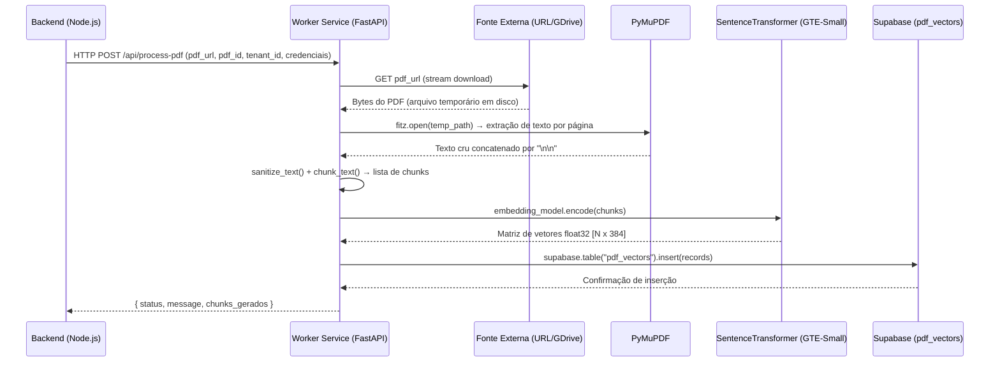

# MindDesk - Worker Service (Ingestão de PDFs)

Este microserviço em Python (FastAPI) atua como o **Esteireiro de Conhecimento** do ecossistema MindDesk.

A sua responsabilidade exclusiva é realizar o pipeline completo de ingestão de documentos PDF: baixar o arquivo de uma URL remota, extrair e sanitizar o texto, fatiá-lo em chunks semânticos, vetorizá-los com o modelo GTE-Small e persistir os registros na tabela vetorial do Supabase. Ele é o único responsável por transformar um PDF bruto em conhecimento pesquisável pela arquitetura RAG.

---

## Posição no Ecossistema MindDesk

O Worker Service é acionado pelo backend Node.js sempre que um administrador realiza o upload de um novo documento institucional. Ele opera de forma síncrona e bloqueante por design — a resposta só retorna após a conclusão total da esteira, garantindo que o Agente RAG já tenha acesso imediato ao documento.



---

## Arquitetura e Fluxo de Dados (SRP)

O serviço concentra sua lógica no `main.py` de forma intencional. Por ser um **worker de pipeline linear** (sem ramificações de lógica de negócio), a separação em múltiplos módulos adicionaria indireção sem benefício. O isolamento ocorre na camada de dados: cada cliente (`tenant_id`) tem seus vetores segregados no banco.

```text
/app
└── main.py          # Aplicação completa: contrato, pipeline e funções auxiliares
    ├── ProcessPDFPayload   # DTO de entrada (Pydantic)
    ├── sanitize_text()     # Limpeza e normalização de texto bruto
    ├── chunk_text()        # Fatiamento semântico com sobreposição (overlap)
    └── process_pdf()       # Controller: orquestra as 6 etapas da esteira
```

---

## Detalhamento do Pipeline e Funções

### 1. Contrato de Entrada (`ProcessPDFPayload`)

O DTO recebe as credenciais do Supabase diretamente no payload, em vez de variáveis de ambiente fixas. Isso habilita a arquitetura **multi-tenant dinâmica**: o mesmo worker pode gravar na base de dados de clientes distintos em requisições paralelas, sem nenhuma reconfiguração de servidor.

```python
class ProcessPDFPayload(BaseModel):
    pdf_url: str       # URL pública do documento (suporta GDrive com export=download)
    pdf_id: int        # ID de referência do PDF na tabela relacional
    tenant_id: int     # Chave de isolamento de dados por cliente
    supabase_url: str  # Endpoint REST dinâmico por tenant
    supabase_key: str  # Service Role Key (acesso irrestrito ao schema vetorial)
```

### 2. Sanitização de Texto (`sanitize_text`)

Normaliza o texto extraído do PDF antes do chunking. Remove ruído típico de extração (quebras múltiplas, caracteres invisíveis) e preserva o conjunto de caracteres necessário para o português brasileiro.

```python
def sanitize_text(text: str) -> str:
    text = re.sub(r'\s+', ' ', text)                        # Colapsa espaços múltiplos e \n internos
    text = re.sub(r'[^\x00-\x7F\u00C0-\u017F]+', '', text) # Mantém ASCII + bloco Latin Extended (acentuação PT-BR)
    return text.strip()
```

### 3. Motor de Chunking com Overlap (`chunk_text`)

Fatia o texto em janelas deslizantes de palavras. A sobreposição (`overlap`) garante que conceitos que cruzam fronteiras de chunk não sejam truncados, preservando a coerência semântica que o modelo de embedding irá capturar.

```python
def chunk_text(text: str, chunk_size: int = 300, overlap: int = 50) -> list[str]:
    words = text.split()
    chunks = []
    for i in range(0, len(words), chunk_size - overlap):
        chunk = " ".join(words[i:i + chunk_size])
        chunks.append(chunk)
        if i + chunk_size >= len(words):
            break
    return chunks
```

| Parâmetro    | Valor padrão | Impacto                                               |
|--------------|-------------|-------------------------------------------------------|
| `chunk_size` | 300 palavras | Controla a granularidade do contexto enviado ao LLM   |
| `overlap`    | 50 palavras  | Evita perda de contexto nas bordas dos chunks         |

### 4. Esteira Principal (`process_pdf`) — 6 Etapas

**Etapa 1 — Download via Stream:** O PDF é baixado em chunks de 8KB para um arquivo temporário, evitando que documentos grandes saturem a memória do container.

```python
response = requests.get(payload.pdf_url, stream=True, timeout=60)
temp_file = tempfile.NamedTemporaryFile(delete=False, suffix=".pdf")
for chunk in response.iter_content(chunk_size=8192):
    if chunk:
        temp_file.write(chunk)
```

**Etapa 2 — Extração com PyMuPDF:** O `fitz` itera página por página, extraindo texto estruturado no modo `"text"`. Páginas em branco são descartadas. Caso o documento inteiro não contenha texto selecionável (PDF de imagem/scan), uma exceção semântica é levantada antes de qualquer processamento custoso.

```python
with fitz.open(temp_path) as doc:
    for page in doc:
        text = page.get_text("text").replace("\r", "").strip()
        if text:
            text_parts.append(text)
```

**Etapa 3 — Sanitização e Chunking:** O texto completo passa pela limpeza e depois pelo fatiamento em chunks de 300 palavras com overlap de 50.

**Etapa 4 — Vetorização em Lote:** O modelo GTE-Small (carregado globalmente na inicialização) processa todos os chunks de uma vez em uma única chamada `encode()`, aproveitando a vetorização em lote da biblioteca para máxima eficiência de CPU.

```python
# embedding_model é global — carregado uma única vez no boot do servidor
embeddings = embedding_model.encode(chunks)  # Retorna ndarray [N x 384]
```

**Etapa 5 — Persistência Multi-Tenant:** O cliente Supabase é instanciado dinamicamente por requisição, usando as credenciais do payload. Os registros são montados em memória e inseridos em uma única operação de batch no banco.

```python
supabase: Client = create_client(payload.supabase_url, payload.supabase_key)

records_to_insert = [{
    "pdf_id": payload.pdf_id,
    "tenant_id": payload.tenant_id,
    "chunk_text": chunk_str,
    "embedding": vector.tolist(),       # ndarray → lista Python para serialização JSON
    "chunk_index": index,
    "embedding_model_used": "gte-small" # Auditoria de versão do modelo
} for index, (chunk_str, vector) in enumerate(zip(chunks, embeddings))]

supabase.table("pdf_vectors").insert(records_to_insert).execute()
```

**Etapa 6 — Faxina Garantida (`finally`):** O arquivo temporário é removido do disco incondicionalmente, mesmo em caso de falha em qualquer etapa anterior. O bloco `finally` garante que nenhum PDF vaze para o sistema de arquivos do container.

```python
finally:
    if temp_path and os.path.exists(temp_path):
        try:
            os.remove(temp_path)
        except OSError:
            pass
```

---

## Exemplo de Integração (Cliente Python)

O script abaixo demonstra a chamada ao Worker, incluindo o parsing de links do Google Drive para o formato de download direto — necessário pois links `/view` não são downloadáveis diretamente.

```python
import requests

WORKER_URL = "http://localhost:8005/api/process-pdf"

# Converte link de visualização do GDrive para URL de download direto
LINK_VIEW = "https://drive.google.com/file/d/<FILE_ID>/view?usp=sharing"
file_id = LINK_VIEW.split("/d/")[1].split("/")[0]
direct_download_url = f"https://drive.google.com/uc?export=download&id={file_id}"

payload = {
    "pdf_url": direct_download_url,
    "pdf_id": 101,       # ID do PDF na sua tabela relacional
    "tenant_id": 1,      # ID do cliente/empresa
    "supabase_url": "https://<PROJECT>.supabase.co/",
    "supabase_key": "<SERVICE_ROLE_KEY>"
}

response = requests.post(WORKER_URL, json=payload, timeout=90)
# Retorno esperado: { "status": "success", "chunks_gerados": 47 }
```

> ⚠️ **Timeout:** O `timeout=90` é intencional. PDFs extensos (100+ páginas) podem levar entre 30–60 segundos para completar a esteira completa de extração + vetorização.

---

## Escalabilidade e Manutenção

1. **Eficiência de Boot:** Assim como o Agente RAG, o `Dockerfile` realiza o pre-download do modelo GTE-Small (~120MB) durante a construção da imagem. O servidor inicia com o modelo já em memória, eliminando latência de cold-start e instabilidade de rede durante o scale-out dos containers.

2. **Isolamento de Memória Temporária:** O uso de `tempfile.NamedTemporaryFile` garante que cada PDF processado ocupe espaço em disco apenas durante sua própria requisição. O bloco `finally` assegura a limpeza independentemente do resultado, prevenindo acúmulo de arquivos em ambientes de alta carga.

3. **Auditoria de Modelo (`embedding_model_used`):** Cada chunk persistido no banco registra qual versão do modelo de embedding foi usada em sua geração. Isso é crítico para futuras migrações de modelo: permite identificar e re-vetorizar apenas os registros gerados por modelos deprecados, sem reconstruir toda a base vetorial.

4. **Multi-Tenancy Dinâmica:** A injeção de credenciais via payload — em vez de variáveis de ambiente — permite que uma única instância do worker sirva múltiplos tenants com bases Supabase distintas, sem necessidade de deploys paralelos por cliente.

5. **Paridade Arquitetural:** O serviço utiliza o mesmo modelo GTE-Small (`thenlper/gte-small`) que o Agente RAG, garantindo que os vetores gerados na ingestão sejam matematicamente compatíveis com os vetores de busca gerados em tempo real. Uma divergência de modelo quebraria silenciosamente toda a similaridade semântica.