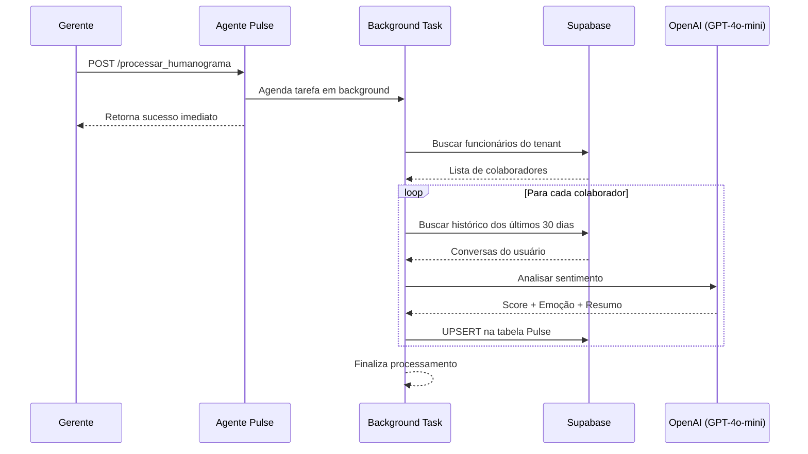

# MindDesk - Agente Pulse (Humanograma)

Este microserviço em Python (FastAPI) atua como o **Psicólogo Organizacional Automatizado** do ecossistema MindDesk.

Sua responsabilidade é monitorar continuamente o clima organizacional através da análise das interações entre funcionários e o assistente corporativo. O serviço processa conversas históricas, identifica padrões emocionais, calcula indicadores de humor e engajamento, e alimenta o módulo de Humanograma utilizado pelos gestores para acompanhamento preventivo de riscos comportamentais.

---

## Posição no Ecossistema MindDesk

O Agente Pulse é acionado pelos gestores quando desejam atualizar o Humanograma da equipe. Diferente dos demais agentes conversacionais, ele executa um processamento assíncrono em lote, analisando todos os colaboradores vinculados ao tenant e persistindo indicadores emocionais consolidados.



---

## Arquitetura e Fluxo de Dados (SRP)

O serviço foi estruturado para separar claramente as responsabilidades de orquestração, persistência e análise emocional baseada em IA.

```text
/app
├── main.py
├── core/
│   └── schemas.py
├── api/
│   └── routes.py
└── services/
    ├── db_service.py
    └── llm_service.py
```

---

## Fluxo Completo do Humanograma

Quando o gerente solicita a atualização do Humanograma:

1. A API recebe a requisição.
2. A tarefa é enviada para execução em segundo plano.
3. Os funcionários do tenant são carregados.
4. O histórico de conversas dos últimos 30 dias é recuperado.
5. A OpenAI realiza análise emocional individual.
6. O resultado é persistido na tabela Pulse.
7. O dashboard passa a consumir os dados atualizados.

```python
background_tasks.add_task(
    rotina_processamento_pulse,
    request
)
```

Esse mecanismo evita que o Front-End fique bloqueado aguardando centenas de análises serem concluídas.

---

## Detalhamento dos Módulos

### 1. Orquestrador de Humanograma (`api/routes.py`)

Responsável por iniciar o processamento completo da análise comportamental.

Trecho principal:

```python
@router.post("/processar_humanograma")
async def processar_humanograma(
    request,
    background_tasks
):
    background_tasks.add_task(
        rotina_processamento_pulse,
        request
    )

    return PulseResponse(
        status="sucesso",
        mensagem="Análise iniciada."
    )
```

A estratégia de Background Tasks permite resposta imediata para o usuário, enquanto a carga pesada continua executando em paralelo.

---

### 2. Motor de Coleta de Conversas (`services/db_service.py`)

Este módulo realiza toda comunicação com o Supabase.

Funções principais:

#### Buscar colaboradores

```python
buscar_subordinados()
```

Consulta a tabela de usuários do tenant e retorna os funcionários que serão avaliados.

```python
GET /usuarios
```

---

#### Buscar histórico recente

```python
buscar_historico_recente()
```

Recupera exclusivamente mensagens dos últimos 30 dias.

```python
params = {
    "created_at": f"gte.{trinta_dias_atras}"
}
```

Esse filtro garante que o Humanograma reflita o estado emocional atual do colaborador.

---

#### Atualização da Tabela Pulse

```python
upsert_pulse()
```

Persistência realizada utilizando UPSERT nativo do Supabase:

```python
headers = {
    "Prefer": "resolution=merge-duplicates"
}
```

Com isso:

* Se o registro existir → Atualiza.
* Se não existir → Cria automaticamente.

---

### 3. Motor de Análise Emocional (`services/llm_service.py`)

Responsável pela interpretação psicológica das conversas.

O sistema compila todas as mensagens do colaborador:

```python
mensagens_usuario = [
    msg["content"]
    for msg in historico
    if msg["role"] == "user"
]
```

Depois envia para a OpenAI:

```python
response = await client.chat.completions.create(
    model="gpt-4o-mini",
    messages=[...]
)
```

---

## Estrutura de Resposta da IA

A IA é obrigada a responder exclusivamente em JSON.

```json
{
  "score_humor": 72,
  "sentimento_predominante": "Animado",
  "resumo_ia": "O colaborador demonstrou interesse em treinamentos e baixa incidência de reclamações."
}
```

---

## Modelo de Avaliação Utilizado

O Humanograma gera três artefatos principais:

### Score de Humor

Escala de:

```text
0   → Alto risco emocional
50  → Estado neutro
100 → Engajamento elevado
```

---

### Sentimento Predominante

Classificação única da emoção dominante.

Exemplos:

```text
Animado
Frustrado
Ansioso
Cansado
Neutro
Motivado
Desengajado
```

---

### Resumo Gerencial

Síntese produzida pela IA para auxiliar lideranças.

Exemplo:

```text
O colaborador demonstra bom engajamento com os processos internos,
mas apresentou sinais recentes de sobrecarga relacionados à jornada.
```

---

## Pipeline de Processamento em Lote

A rotina principal percorre todos os funcionários individualmente.

```python
for func in funcionarios:

    historico = await buscar_historico_recente(...)

    analise = await analisar_sentimento_historico(
        historico,
        api_key
    )

    await upsert_pulse(...)
```

Essa abordagem garante isolamento entre análises e evita contaminação de contexto entre colaboradores.

---

## Estratégias de Resiliência

### Falta de Histórico

Caso não existam mensagens recentes:

```python
{
    "score_humor": 50,
    "sentimento_predominante": "Neutro",
    "resumo_ia": "Sem interações recentes."
}
```

O sistema evita classificações artificiais quando não há dados suficientes.

---

### Falhas da OpenAI

Se ocorrer qualquer erro na análise:

```python
except Exception:
    return {
        "score_humor": 50,
        "sentimento_predominante": "Neutro",
        "resumo_ia": "Falha ao processar análise."
    }
```

Dessa forma o pipeline continua executando para os demais funcionários.

---

## Escalabilidade e Manutenção

### Processamento Assíncrono

O uso de:

```python
BackgroundTasks
```

permite que o processamento seja executado sem bloquear requisições HTTP.

---

### Atualizações Incrementais

O uso de UPSERT elimina necessidade de:

* verificar existência;
* executar UPDATE;
* executar INSERT.

Tudo ocorre em uma única operação.

---

### Baixo Acoplamento

O serviço não possui dependência direta com:

* Agente RAG;
* Agente Tools;
* Agente Docs;
* Orquestrador.

Ele consome apenas:

* OpenAI
* Supabase

facilitando manutenção e deploy independente.

---

## Papel Estratégico no Ecossistema MindDesk

Enquanto os demais agentes respondem perguntas ou executam ações operacionais, o Agente Pulse transforma conversas corporativas em inteligência gerencial.

Ele funciona como uma camada contínua de observabilidade humana, permitindo que gestores identifiquem precocemente sinais de:

* Burnout;
* Desengajamento;
* Insatisfação;
* Sobrecarga operacional;
* Risco de Turnover.

Os dados produzidos por este serviço servem como base para o módulo de People Analytics e para os dashboards estratégicos de RH do ecossistema MindDesk.
