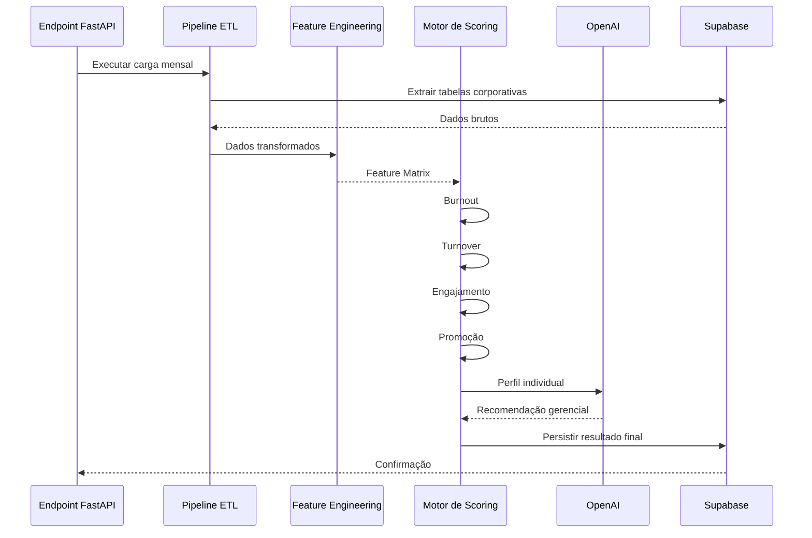

# MindDesk - Motor de People Analytics

Este microserviço em Python (FastAPI) atua como o **Analista Organizacional Automatizado** do ecossistema MindDesk.

Sua responsabilidade exclusiva é consolidar dados operacionais dispersos em múltiplas fontes corporativas, transformá-los em indicadores comportamentais e produzir análises preditivas sobre saúde organizacional, engajamento, turnover e potencial de desenvolvimento dos colaboradores.

O serviço implementa um pipeline completo de People Analytics composto por ETL, Feature Engineering, Scoring Heurístico e Inteligência Artificial Generativa, permitindo transformar dados brutos de RH em informações estratégicas para tomada de decisão.

---

## Posição no Ecossistema MindDesk

O Motor de People Analytics opera como um processo analítico periódico responsável por gerar indicadores consolidados para toda a organização.



---

## Objetivo Estratégico

O serviço foi projetado para responder perguntas críticas de gestão de pessoas:

* Quem apresenta risco de burnout?
* Quem possui maior risco de desligamento?
* Quais colaboradores demonstram maior engajamento?
* Quem possui elegibilidade para promoção?
* Quais equipes apresentam sinais de desgaste organizacional?
* Quais ações gerenciais devem ser tomadas?

---

## Arquitetura e Fluxo de Dados (SRP)

A arquitetura foi dividida em módulos especializados.

```text
/app
├── main.py
│
├── routes/
│   └── people_analytics.py
│
└── services/
    ├── extract.py
    ├── transform.py
    ├── load.py
    ├── analise_ia.py
    └── service.py
```

---

## Pipeline Analítico Completo

O processamento segue quatro macroetapas.

```text
Extração
    ↓
Transformação
    ↓
Feature Engineering
    ↓
Scoring + IA
    ↓
Persistência
```

---

# Etapa 1 — Extração de Dados

## Fonte de Dados Corporativos

O módulo:

```python
extract.py
```

realiza a extração integral das tabelas corporativas.

Fontes consumidas:

```text
usuarios
pulse
historico_cursos
historico_promocoes
pontos
banco_horas
ferias
atestados
```

---

## Paginação Automática

Como o Supabase possui limites de retorno por consulta, o sistema implementa paginação automática.

```python
chunk_size = 1000
```

Executando múltiplas chamadas até que todos os registros sejam recuperados.

Essa estratégia permite processar organizações com milhares de colaboradores sem perda de dados.

---

## Normalização Temporal

Durante a extração, colunas de data são convertidas automaticamente.

```python
pd.to_datetime(...)
```

garantindo consistência para cálculos posteriores.

---

# Etapa 2 — Transformação de Dados

O módulo:

```python
transform.py
```

executa o tratamento analítico das informações.

---

## Análise de Jornada

A partir da tabela:

```text
pontos
```

o sistema calcula:

* horas extras
* faltas
* atrasos
* desvios de jornada

A análise considera uma janela móvel de:

```text
6 meses
```

para reduzir distorções pontuais.

---

## Reconstrução de Presença

Uma grade completa de dias úteis é criada.

```python
itertools.product(...)
```

permitindo detectar ausências mesmo quando não existem registros de ponto.

Essa técnica elimina falsos positivos.

---

## Mapeamento de Saúde Ocupacional

A partir dos atestados:

```text
atestados
```

cada afastamento é expandido para granularidade diária.

Exemplo:

```text
Atestado:
5 dias
```

Transforma-se em:

```text
Dia 1
Dia 2
Dia 3
Dia 4
Dia 5
```

facilitando cálculos epidemiológicos e análises de frequência.

---

## Histórico de Férias

O sistema calcula:

```python
tempo_meses_ultimas_férias
```

indicador amplamente utilizado para identificar fadiga ocupacional.

---

## Promoções

A partir do histórico de cargos:

```text
historico_promocoes
```

o sistema mede:

* promoções recebidas
* tempo de permanência
* estagnação profissional

---

## Educação Corporativa

O processamento separa:

### Cursos Obrigatórios

Indicadores:

* concluídos antecipadamente
* concluídos no prazo
* vencidos

### Cursos Opcionais

Indicadores:

* proatividade
* aprendizado contínuo
* desenvolvimento voluntário

---

# Etapa 3 — Feature Engineering

Após a transformação, é construída uma Feature Matrix consolidada.

```python
orquestrar_feature_engineering()
```

Cada colaborador passa a possuir dezenas de atributos derivados.

Exemplos:

```text
faltas_ultimo_mes
horas_extras_ultimo_mes
qtd_atrasos_ultimo_mes
media_atrasos_trimestre

ausencias_atestado_ultimo_mes

tempo_meses_ultimas_férias

qtt_promocoes
tempo_ultima_promocao

cursos_obg_vencidos
cursos_obg_adiantados

qtt_cursos_opcionais_2anos

score_humor
sentimento_predominante
```

Essa matriz funciona como a base analítica para todos os cálculos posteriores.

---

# Etapa 4 — Motor de Scoring

O módulo:

```python
calcular_scores_heuristicos()
```

gera indicadores sintéticos de gestão.

---

## Score de Burnout

Avalia fatores como:

* excesso de horas extras
* ausência prolongada de férias
* frequência de atestados
* sentimento predominante
* humor organizacional

Resultado:

```text
0 → 100
```

onde valores maiores representam maior risco.

---

## Score de Turnover

Avalia:

* atrasos recorrentes
* faltas
* baixa aderência a treinamentos
* estagnação profissional
* clima organizacional

Resultado:

```text
0 → 100
```

representando probabilidade de desligamento.

---

## Score de Engajamento

Considera:

* participação em treinamentos
* pontualidade
* humor
* iniciativa educacional

Resultado:

```text
0 → 100
```

representando envolvimento organizacional.

---

## Score de Elegibilidade para Promoção

Modelo composto por:

* tempo de maturidade no cargo
* engajamento
* cursos opcionais
* riscos organizacionais

O algoritmo aplica travas explícitas.

Exemplo:

```python
if tempo_ultima_promocao < 12:
    score = 0
```

impedindo recomendações prematuras.

---

# Inteligência Artificial Generativa

Após o cálculo quantitativo, o sistema produz interpretação qualitativa.

Módulo:

```python
analise_ia.py
```

---

## Perfil Individual

Para cada colaborador é montado um prompt contendo:

```text
Cargo
Burnout
Turnover
Engajamento
Promoções
Sentimento
```

Exemplo:

```text
Nome: João
Score Burnout: 78
Score Turnover: 65
Score Engajamento: 35
```

---

## Recomendação Gerencial

A OpenAI gera:

```text
Máximo de duas frases
```

com foco em:

* risco de burnout
* risco de desligamento
* ações de engajamento
* desenvolvimento profissional

O resultado é armazenado em:

```python
analise_pa
```

---

# Persistência Analítica

Os resultados são carregados para:

```text
people_analytics
```

através do módulo:

```python
load.py
```

---

## Estrutura de Saída

Cada registro contém:

```text
Features calculadas
Scores organizacionais
Sentimento
Análise da IA
Mês de referência
```

criando um Data Mart especializado para RH.

---

# Controle de Reprocessamento

Antes da execução, o sistema verifica:

```python
verificar_mes_referencia_people_analytics()
```

Caso o período já tenha sido processado:

```json
{
  "status": "skipped"
}
```

evitando duplicidade de informações.

---

# Escalabilidade e Performance

## Processamento Vetorizado

Grande parte dos cálculos utiliza:

```python
Pandas
```

explorando operações vetorizadas em vez de loops manuais.

---

## Pipeline Modular

Cada etapa possui responsabilidade isolada:

```text
Extract
Transform
Feature Engineering
Scoring
Load
```

facilitando manutenção e evolução.

---

## Reprodutibilidade

A geração das features segue regras determinísticas.

O mesmo conjunto de dados sempre produzirá os mesmos scores.

Isso garante auditabilidade dos indicadores.

---

## Extensibilidade

Novos indicadores podem ser adicionados sem alterar as demais camadas.

Exemplo:

```text
Score de Liderança
Score de Absenteísmo
Score de Performance
```

podem ser incorporados apenas criando novos módulos de cálculo.

---

# Papel Estratégico na Plataforma

O Motor de People Analytics representa a camada analítica do MindDesk.

Enquanto outros microsserviços executam operações e respondem perguntas, este componente transforma eventos operacionais em inteligência organizacional.

Seu papel é converter milhões de registros dispersos em indicadores acionáveis que permitam antecipar riscos, aumentar retenção, identificar talentos e apoiar decisões estratégicas de gestão de pessoas.

Na prática, ele funciona como um cientista de dados organizacional automatizado, operando continuamente sobre toda a base corporativa.
