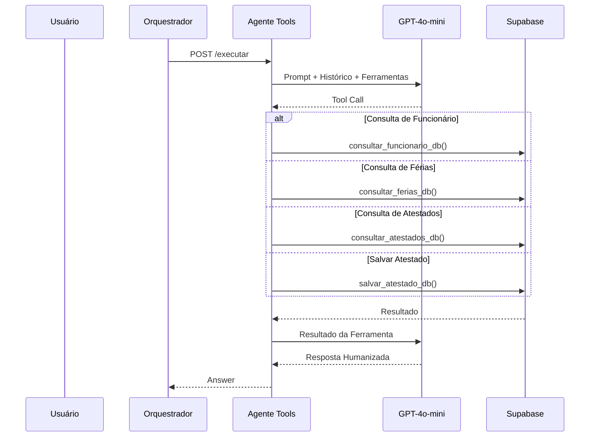

# MindDesk - Agente de Ferramentas (Tools Agent)

Este microserviço em Python (FastAPI) atua como o **Especialista Transacional** do ecossistema MindDesk.

Sua responsabilidade exclusiva é executar consultas e operações estruturadas sobre os dados corporativos armazenados no banco de dados, utilizando o mecanismo de Function Calling da OpenAI para converter linguagem natural em ações concretas.

Diferentemente do Agente RAG, que responde utilizando documentos institucionais, o Agente Tools opera diretamente sobre informações operacionais da empresa, como colaboradores, férias e atestados médicos.

---

## Posição no Ecossistema MindDesk

O Agente Tools é acionado pelo Orquestrador sempre que a intenção identificada exige acesso ou modificação de dados estruturados.



---

## Arquitetura e Fluxo de Dados (SRP)

O microserviço foi dividido em camadas para separar claramente raciocínio, persistência e exposição HTTP.

```text
/app
├── main.py
│
├── api/
│   └── routes.py
│
├── core/
│   └── schemas.py
│
└── services/
    ├── llm_service.py
    └── db_service.py
```

---

## Filosofia Arquitetural

O Agente Tools segue o padrão:

```text
Natural Language
        ↓
GPT Tool Calling
        ↓
Função Python
        ↓
Banco de Dados
        ↓
Resultado Estruturado
        ↓
GPT
        ↓
Resposta Humanizada
```

A IA não acessa diretamente o banco.

Ela apenas decide:

* qual ferramenta utilizar
* quais parâmetros enviar
* como interpretar o resultado

Toda interação real ocorre através de funções controladas pelo backend.

---

## Contrato de Entrada

Todas as operações utilizam o DTO:

```python
class ToolPayload(BaseModel):
    query: str
    tenant_id: int
    user_id: str
    role: str
    history: list
```

Além da pergunta do usuário, o payload contém:

* identificação do colaborador
* tenant corporativo
* histórico da conversa
* credenciais de integração

permitindo que o agente mantenha contexto operacional durante múltiplas interações.

---

## Motor de Raciocínio com Function Calling

O núcleo do sistema encontra-se em:

```text
services/llm_service.py
```

A OpenAI recebe:

```python
messages
tools
tool_choice="auto"
```

A partir desse ponto, o modelo deixa de ser apenas um chatbot e passa a atuar como um planejador de execução.

Exemplo:

Usuário:

```text
Quais férias o João possui registradas?
```

O GPT identifica automaticamente:

```json
{
  "function": "consultar_ferias_db",
  "nome": "João"
}
```

sem necessidade de programação específica para cada frase possível.

---

## Catálogo de Ferramentas

O agente expõe um conjunto controlado de operações.

### Consulta de Funcionários

```python
consultar_funcionario_db()
```

Responsável por buscar:

* nome
* cargo
* data de admissão
* saldo de férias

---

### Consulta de Férias

```python
consultar_ferias_db()
```

Busca:

* períodos usufruídos
* períodos programados
* status das solicitações

---

### Consulta de Atestados

```python
consultar_atestados_db()
```

Retorna:

* data de emissão
* dias de afastamento
* CID
* status do documento

---

### Persistência de Atestados

```python
salvar_atestado_db()
```

Responsável por registrar documentos médicos processados pelo Agente Docs.

Campos persistidos:

```json
{
  "data_emissao": "...",
  "dias_afastamento": 5,
  "motivo_cid": "J11",
  "url_arquivo": "..."
}
```

---

## Pipeline de Execução

### Etapa 1 — Interpretação

O GPT recebe:

```python
messages
```

contendo:

* prompt do sistema
* histórico recente
* mensagem atual

---

### Etapa 2 — Seleção de Ferramenta

O modelo avalia:

```python
TOOLS_SCHEMA
```

e escolhe automaticamente a função mais adequada.

```python
tool_choice="auto"
```

---

### Etapa 3 — Execução Backend

O backend interpreta:

```python
response_message.tool_calls
```

e executa a função correspondente.

```python
if tool_call.function.name == "consultar_ferias_db":
```

Essa etapa elimina qualquer possibilidade de execução arbitrária por parte da IA.

---

### Etapa 4 — Retorno para o Modelo

Após a consulta:

```python
messages.append({
    "role": "tool",
    "content": dados_do_banco
})
```

O resultado é devolvido ao GPT.

---

### Etapa 5 — Geração da Resposta Final

A OpenAI transforma o resultado técnico em linguagem natural.

Exemplo:

Resultado bruto:

```text
Data: 2025-02-01
Status: Aprovado
```

Resposta final:

```text
João possui férias aprovadas entre 01/02/2025 e 15/02/2025.
```

---

## Fluxo Especial de Atestados

O agente implementa um mecanismo de confirmação humana antes da gravação definitiva.

### Leitura Inicial

O Agente Docs extrai:

```text
Data
CID
Dias de afastamento
```

---

### Validação do Usuário

O assistente pergunta:

```text
Os dados estão corretos?
```

---

### Confirmação

Usuário:

```text
Sim
```

---

### Persistência

O GPT identifica a intenção e executa:

```python
salvar_atestado_db()
```

utilizando os dados previamente armazenados no histórico.

Esse padrão reduz drasticamente erros de lançamento.

---

## Camada de Banco de Dados

O acesso aos dados ocorre através do Supabase REST API.

```python
httpx.AsyncClient()
```

Consultas realizadas:

```text
usuarios
ferias
atestados
```

Todas filtradas por:

```python
tenant_id
```

garantindo isolamento entre empresas.

---

## Segurança Multitenant

Toda operação utiliza obrigatoriamente:

```python
tenant_id
```

e

```python
user_id
```

impedindo vazamento de informações entre organizações.

Nenhuma consulta é executada sem escopo corporativo explícito.

---

## Controle de Permissões

A decisão sobre quem pode acessar o agente ocorre no Orquestrador.

Dessa forma o Agente Tools recebe apenas solicitações previamente autorizadas.

Isso mantém a lógica de autorização desacoplada da lógica transacional.

---

## Escalabilidade e Performance

### 1. Comunicação Assíncrona

Todas as integrações utilizam:

```python
httpx.AsyncClient
```

evitando bloqueio do Event Loop.

---

### 2. Ferramentas Declarativas

Novas operações podem ser adicionadas apenas registrando uma nova função em:

```python
TOOLS_SCHEMA
```

sem necessidade de alterar o fluxo principal de raciocínio.

---

### 3. Baixo Acoplamento

O GPT não conhece:

* SQL
* Supabase
* estrutura física do banco

Ele conhece apenas contratos de ferramentas.

Isso permite trocar a tecnologia de persistência sem alterar o comportamento conversacional.

---

### 4. Observabilidade

Logs estruturados registram:

```python
logger.info(...)
logger.error(...)
```

permitindo monitoramento completo das operações executadas.

---

## Papel Estratégico na Plataforma

O Agente Tools representa a camada operacional do MindDesk.

Enquanto o Agente RAG responde perguntas utilizando conhecimento institucional, o Tools Agent executa ações reais sobre os dados da empresa.

Ele transforma intenções em operações concretas através de Function Calling, criando uma ponte segura entre Inteligência Artificial e sistemas corporativos.

Na prática, ele funciona como um analista de RH digital capaz de consultar, validar e registrar informações sem exigir que o usuário conheça tabelas, APIs ou estruturas de banco de dados.
