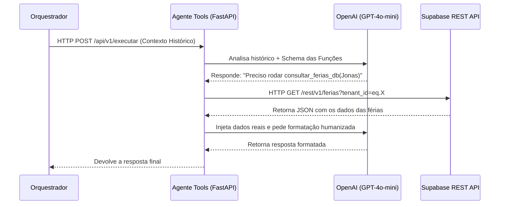

# MindDesk - Agente Tools (Microserviço de Consulta Estruturada)

Este microserviço em Python (FastAPI) atua como o **Especialista em Banco de Dados** do ecossistema de Inteligência Artificial da plataforma **MindDesk**. 

A sua responsabilidade única é receber solicitações delegadas pelo Orquestrador, interpretar a intenção do usuário utilizando o padrão de arquitetura **Function Calling (Tools)** da OpenAI e extrair dados operacionais estruturados (Férias, Atestados, Histórico do Funcionário) diretamente do Data Warehouse (Supabase) da empresa.

---

##  Posição no Ecossistema MindDesk

O Agente Tools atua na "Ponta de Lança", recebendo apenas tráfego que o Roteador Semântico determinou como uma busca de banco de dados.



---

##  Arquitetura Orientada a Serviços (SRP)

O microserviço foi refatorado para garantir alta coesão e baixo acoplamento:

```text
/app
├── main.py                 # Ponto de entrada ASGI da aplicação
├── core/
│   └── schemas.py          # Declaração do Pydantic Payload e do TOOLS_SCHEMA (Manual da IA)
├── api/
│   └── routes.py           # Endpoints isolados de regras de negócio
└── services/
    ├── db_service.py       # Interação Assíncrona via HTTP REST com o Banco de Dados
    └── llm_service.py      # Lógica de Orquestração Reversa e Function Calling (OpenAI)
```

---

##  Detalhamento de Módulos e Funções

### 1. Motor de LLM (`app/services/llm_service.py`)
Utiliza o cliente `AsyncOpenAI`. É responsável pelo ciclo duplo de inteligência:
1. **Primeira Chamada:** Pede para a IA avaliar se precisa buscar dados.
2. **Execução de Tools:** Executa as funções Python baseando-se na decisão da IA.
3. **Segunda Chamada:** Devolve o JSON bruto do banco para a IA transformar em um texto legível e empático.

### 2. Guardião de I/O de Dados (`app/services/db_service.py`)
Responsável pelas extrações no banco Supabase. **Nota de Arquitetura:** Este serviço aboliu o uso de SDKs síncronos da provedora do banco e utiliza `httpx` assíncrono para garantir que o Event Loop do FastAPI não sofra gargalos durante consultas pesadas, prevenindo também o erro crônico de proxy.

Exemplo de design das funções I/O:
```python
async def consultar_ferias_db(nome: str, tenant_id: int, supa_url: str, supa_key: str) -> str:
    # 1. Busca assíncrona do ID do funcionário (Filtro por Tenant ILIKE)
    # 2. Busca assíncrona da tabela relacional de Férias
    # 3. Tratamento de retornos vazios ou múltiplos
```

### 3. Schemas Estritos (`app/core/schemas.py`)
Além do payload de rede, hospeda o `TOOLS_SCHEMA`. Se uma nova tabela for criada no banco (ex: *Folha de Pagamento*), basta declarar a assinatura da ferramenta aqui e a IA aprenderá instantaneamente como utilizá-la.

---

## Escalabilidade e Manutenção

1. **Assincronismo I/O Bound:** Como todas as chamadas (OpenAI e Supabase) são não-bloqueantes (`await`), um único worker do Uvicorn consegue suportar milhares de conexões simultâneas sem consumir alta carga de CPU.
2. **Separação do Schema:** Alterações nas regras de negócio (como o formato que o RH quer exibir as férias) são feitas isoladamente no `db_service.py`, sem risco de quebrar o modelo mental do `llm_service.py`.
3. **Deploy Contínuo:** Utiliza Live Reload local com montagem de volumes, e Docker nativo (`3.9-slim`) preparado para instâncias efêmeras na nuvem.