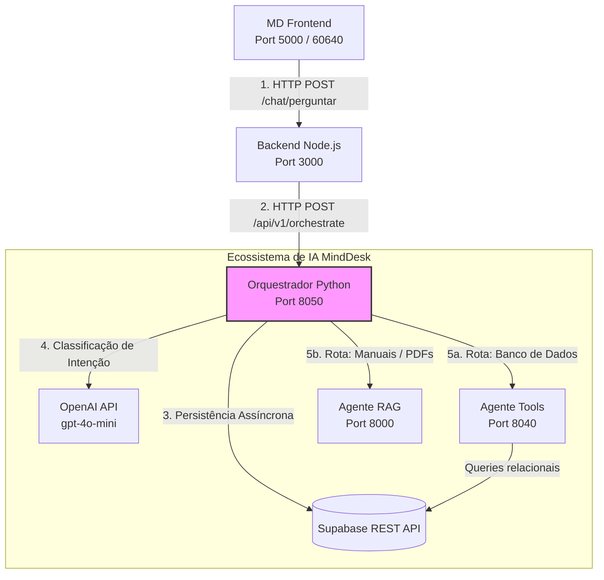

# MindDesk - Orquestrador de Agentes (Microserviço de Roteamento Semântico)

Este microserviço em Python (FastAPI) atua como o **Maestro Central (Gateway Inteligente)** do ecossistema de Inteligência Artificial da plataforma **MindDesk**. 

A sua principal responsabilidade é receber as interações do usuário vindas do Backend em Node.js, interceptar e persistir o histórico de conversas em tempo de execução no banco de dados, e aplicar **Roteamento Semântico (Semantic Routing)** baseado em contexto de conversação histórica para delegar a tarefa ao microserviço especialista adequado (`Agente Tools` ou `Agente RAG`).

---

##  Arquitetura do Ecossistema MindDesk

O ecossistema adota uma arquitetura distribuída baseada em microsserviços orientados a escopos específicos. O Orquestrador centraliza o estado semântico da aplicação sem acoplar as regras de negócio ou as conexões internas de dados dos sub-agentes.



---

##  Estrutura de Pastas e SRP (Single Responsibility Principle)

A aplicação segue a separação estrita de conceitos em camadas isoladas:

```text
/app
├── main.py                 # Inicialização da aplicação ASGI e middlewares
├── core/
│   └── schemas.py          # Data Transfer Objects (DTO) e validação de contratos Pydantic
├── api/
│   └── routes.py           # Controller de fluxo de negócio e regras de roteamento (Maestro)
└── services/
    ├── db_service.py       # I/O Assíncrono com a API REST do Supabase
    ├── llm_service.py      # Camada Cognitiva (Inteligência Artificial de Roteamento)
    └── agent_service.py    # Gateway de Comunicação de Rede entre Microsserviços
```

---

##  Detalhamento de Módulos, Classes e Funções

### 1. Camada de Contratos (`app/core/schemas.py`)
Centraliza as validações de tipos de entrada e saída. Garante que os microsserviços mantenham contratos estritos e imutáveis durante a transmissão do payload.

```python
from pydantic import BaseModel

class OrchestratorRequest(BaseModel):
    """Contrato estrito de entrada para orquestração."""
    query: str
    tenant_id: int
    user_id: str
    role: str  
    current_agent: str = "main" 
    session_id: str
    openai_api_key: str
    supabase_url: str
    supabase_key: str

class OrchestratorResponse(BaseModel):
    """Contrato estrito de saída devolvido ao Node.js."""
    answer: str
    new_agent: str
    action: str = "respond"
```

### 2. Camada de Persistência Assíncrona (`app/services/db_service.py`)
Removeu-se o acoplamento da biblioteca síncrona do Supabase (mitigando os bugs internos de concorrência com o `httpx` e problemas de proxy). Utiliza chamadas HTTP puras sobre conexões gerenciadas assincronamente pelo Event Loop do FastAPI.

```python
import httpx
import logging

logger = logging.getLogger(__name__)

async def buscar_contexto_conversa(session_id: str, tenant_id: int, supa_url: str, supa_key: str, limite: int = 6) -> list:
    """
    Efetua um GET assíncrono na API REST do Supabase filtrando a conversa ativa.
    Inverte o resultado cronologicamente antes de retornar para manter a ordem da conversa.
    """
    try:
        endpoint = f"{supa_url}/rest/v1/historico_conversas"
        headers = {
            "apikey": supa_key,
            "Authorization": f"Bearer {supa_key}",
            "Content-Type": "application/json"
        }
        params = {
            "session_id": f"eq.{session_id}",
            "tenant_id": f"eq.{tenant_id}",
            "select": "role,content",
            "order": "created_at.desc",
            "limit": limite
        }
        
        async with httpx.AsyncClient(timeout=10.0) as client:
            response = await client.get(endpoint, headers=headers, params=params)
            response.raise_for_status()
            return response.json()[::-1] # Ordem cronológica ascendente
            
    except Exception as e:
        logger.error(f"[DB ERROR] Falha ao recuperar histórico: {e}")
        return []

async def salvar_mensagem_historico(session_id: str, tenant_id: int, role: str, content: str, supa_url: str, supa_key: str):
    """Registra uma mensagem (user ou assistant) na tabela de histórico."""
    try:
        endpoint = f"{supa_url}/rest/v1/historico_conversas"
        headers = {
            "apikey": supa_key,
            "Authorization": f"Bearer {supa_key}",
            "Content-Type": "application/json",
            "Prefer": "return=minimal"
        }
        payload = {
            "session_id": session_id,
            "tenant_id": tenant_id,
            "role": role,
            "content": content
        }
        
        async with httpx.AsyncClient(timeout=10.0) as client:
            response = await client.post(endpoint, headers=headers, json=payload)
            response.raise_for_status()
            
    except Exception as e:
        logger.error(f"[DB ERROR] Falha ao persistir mensagem: {e}")
```

### 3. Camada Cognitiva e de Roteamento (`app/services/llm_service.py`)
Utiliza o cliente assíncrono oficial da OpenAI (`AsyncOpenAI`) para analisar semanticamente a fofoca/histórico da conversa. Em vez de avaliar apenas a última mensagem do usuário isolada, o roteador analisa o fluxo completo do diálogo atual para inferir a decisão de roteamento correta.

```python
import logging
from openai import AsyncOpenAI

logger = logging.getLogger(__name__)

AGENT_DESCRIPTIONS = {
    "rag": "Use para dúvidas institucionais, manuais de RH, cultura da empresa e políticas gerais.",
    "tools": "Use para consultas de dados específicos de funcionários no banco de dados (férias, atestados, contratação, cargo)."
}

async def classificar_intencao(historico: list, api_key: str) -> str:
    """
    Injeta o histórico estruturado na LLM em formato de diálogo simulado 
    e força a saída estrita de uma das chaves registradas (rag ou tools).
    """
    try:
        client = AsyncOpenAI(api_key=api_key)
        contexto_str = "\n".join([f"{'Usuário' if msg['role'] == 'user' else 'Assistente'}: {msg['content']}" for msg in historico])
        
        prompt = f"""Você é um roteador de requisições de um sistema de RH.
        Analise o histórico da conversa e decida qual agente deve processar a ÚLTIMA mensagem.
        
        Agentes disponíveis:
        {AGENT_DESCRIPTIONS}
        
        Histórico recente da conversa:
        {contexto_str}
        
        Responda APENAS com a chave do agente escolhido (rag ou tools). Não adicione pontuação ou justificativas."""
        
        response = await client.chat.completions.create(
            model="gpt-4o-mini",
            messages=[{"role": "system", "content": prompt}],
            temperature=0.0 # Garante previsibilidade matemática no roteamento
        )
        
        rota = response.choices[0].message.content.strip().lower()
        return rota if rota in ["rag", "tools"] else "rag"
        
    except Exception as e:
        logger.error(f"[LLM ERROR] Erro no Roteador Semântico: {e}")
        return "rag" # Fallback resiliente
```

### 4. Camada de Comunicação de Rede (`app/services/agent_service.py`)
Isola o encapsulamento e a engenharia de rede de comunicação HTTP interna entre o Orquestrador e os sub-agentes do ecossistema.

```python
import httpx
import logging
from fastapi import HTTPException

logger = logging.getLogger(__name__)

AGENTS = {
    "rag": "[http://host.docker.internal:8000/api/v1/ask](http://host.docker.internal:8000/api/v1/ask)",
    "tools": "[http://host.docker.internal:8040/api/v1/executar](http://host.docker.internal:8040/api/v1/executar)"
}

async def repassar_para_agente(target_agent: str, payload: dict) -> str:
    """Dispara o payload unificado ao microsserviço especialista."""
    target_url = AGENTS.get(target_agent)
    if not target_url:
        raise HTTPException(status_code=500, detail="Destino de agente inválido.")
        
    try:
        async with httpx.AsyncClient(timeout=45.0) as client:
            response = await client.post(target_url, json=payload)
            response.raise_for_status()
            return response.json().get("answer", "Resposta vazia do sub-agente.")
            
    except httpx.HTTPError as exc:
        logger.error(f"[NETWORK ERROR] Falha ao contatar o sub-agente {target_agent}: {exc}")
        raise HTTPException(status_code=500, detail=f"O Agente {target_agent} está indisponível.")
```

### 5. Camada de Controle e Fluxo (`app/api/routes.py`)
Esta camada atua estritamente como o **Maestro**. Ela não executa chamadas HTTP diretas, não monta strings de prompts para a LLM e não sabe como salvar dados. Ela lê o payload e chama sequencialmente os serviços especializados. Aqui também residem as verificações de segurança globais (como o controle de acesso RBAC).

```python
from fastapi import APIRouter, HTTPException
import logging

from core.schemas import OrchestratorRequest, OrchestratorResponse
from services.db_service import buscar_contexto_conversa, salvar_mensagem_historico
from services.llm_service import classificar_intencao
from services.agent_service import repassar_para_agente

router = APIRouter()
logger = logging.getLogger(__name__)

@router.post("/orchestrate", response_model=OrchestratorResponse)
async def orchestrate(request: OrchestratorRequest):
    query_lower = request.query.lower()
    
    # Interceptador de comandos globais de fuga de estado
    if any(word in query_lower for word in ["voltar", "sair", "menu principal", "cancelar"]):
        return OrchestratorResponse(
            answer="Certo, cancelei a operação anterior. Como posso te ajudar agora?",
            new_agent="main",
            action="reset"
        )

    # Passo 1: Persistência imediata do input do usuário
    await salvar_mensagem_historico(
        request.session_id, request.tenant_id, "user", request.query, request.supabase_url, request.supabase_key
    )

    # Passo 2: Recuperação do contexto cronológico da conversa atualizada
    historico = await buscar_contexto_conversa(
        request.session_id, request.tenant_id, request.supabase_url, request.supabase_key
    )

    # Passo 3: Avaliação de Escopo e Roteamento
    target_agent = request.current_agent
    if target_agent == "main":
        target_agent = await classificar_intencao(historico, request.openai_api_key)
        logger.info(f"Roteador Semântico direcionou o fluxo para: {target_agent}")

        # Camada de Segurança Centralizada (RBAC) antes de despachar dados sensíveis
        if target_agent == "tools" and request.role == "funcionario":
            return OrchestratorResponse(
                answer="Você não possui permissões administrativas para consultar dados estruturados de funcionários.",
                new_agent="main"
            )

    # Passo 4: Delegação de processamento e empacotamento de contexto para o agente especialista
    payload_to_agent = {
        "query": request.query,
        "tenant_id": request.tenant_id,
        "openai_api_key": request.openai_api_key,
        "supabase_url": request.supabase_url,
        "supabase_key": request.supabase_key,
        "history": historico 
    }
    answer = await repassar_para_agente(target_agent, payload_to_agent)
    
    # Passo 5: Persistência da resposta gerada pela inteligência de negócio
    await salvar_mensagem_historico(
        request.session_id, request.tenant_id, "assistant", answer, request.supabase_url, request.supabase_key
    )
    
    return OrchestratorResponse(answer=answer, new_agent=target_agent, action="continue")
```

---

## Prontidão para Produção e Escalabilidade

A refatoração preparou este microserviço para os seguintes cenários reais de escala:

1. **Troca do ID Mocado do Node para Sessão Real:** O código do Orquestrador já está 100% dinâmico. No momento em que o front-end passar a injetar o ID da sessão real do banco (ou uma hash JWT por usuário), o Orquestrador mudará a segregação de dados imediatamente, sem precisar alterar uma única linha de código em nenhuma camada de serviço.
2. **Desacoplamento de Provedor de IA:**
   Se a empresa migrar da OpenAI para instâncias de modelos locais (como um cluster Ollama com Llama 3) devido a compliance de dados corporativos de RH, a única alteração necessária será dentro da classe `llm_service.py`. Todo o resto da arquitetura continuará rodando transparente.
3. **Escalabilidade Horizontal (Stateless):**
   Como este microserviço **não guarda estado em memória** (ele consome o histórico de forma atômica e assíncrona do banco em cada requisição), você pode subir 10 instâncias desse container atrás de um Load Balancer (Nginx/AWS ALB) sem sofrer com problemas de sincronização de memória entre os servidores de aplicação.