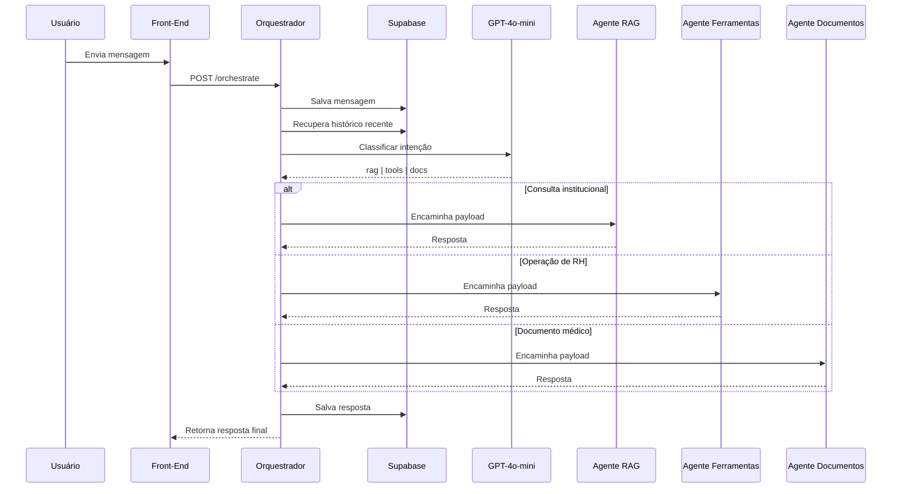

# MindDesk - Orquestrador Semântico de Agentes

Este microserviço em Python (FastAPI) atua como o **Controlador Central de Conversação** do ecossistema MindDesk.

Sua responsabilidade exclusiva é analisar o contexto da conversa, identificar a intenção do usuário e encaminhar a requisição para o agente especializado correto.

Ele funciona como uma camada de decisão inteligente entre o Front-End e os microserviços especialistas (RAG, Ferramentas e Leitura de Documentos), garantindo que cada solicitação seja processada pelo componente mais adequado sem que o usuário precise conhecer a arquitetura interna do sistema.

---

## Posição no Ecossistema MindDesk

O Orquestrador é o primeiro serviço acionado após uma interação do usuário.

Ele mantém o histórico da conversa, interpreta o contexto utilizando IA e seleciona dinamicamente qual agente deverá assumir a próxima etapa do processamento.



---

## Arquitetura e Fluxo de Dados (SRP)

O serviço foi dividido para separar claramente responsabilidades de roteamento, persistência, classificação semântica e comunicação entre microsserviços.

```text
/app
├── main.py
│
├── api/
│   └── routes.py
│
├── core/
│   └── schemas.py
│
└── services/
    ├── db_service.py
    ├── llm_service.py
    └── agent_service.py
```

### Separação de Responsabilidades

| Camada           | Responsabilidade                       |
| ---------------- | -------------------------------------- |
| routes.py        | Pipeline principal de orquestração     |
| schemas.py       | Contratos de entrada e saída           |
| db_service.py    | Persistência e recuperação de contexto |
| llm_service.py   | Classificação semântica                |
| agent_service.py | Comunicação entre microsserviços       |

---

## Pipeline Completo de Orquestração

A requisição percorre quatro estágios obrigatórios:

### 1. Persistência da Mensagem

Antes de qualquer processamento, a mensagem do usuário é armazenada.

```python
await salvar_mensagem_historico(
    request.usuario_id,
    request.tenant_id,
    "user",
    request.query
)
```

Essa estratégia garante:

* rastreabilidade completa
* recuperação de contexto
* análise futura de comportamento
* geração de métricas conversacionais

---

### 2. Recuperação de Contexto

O sistema consulta as últimas mensagens do colaborador.

```python
historico = await buscar_contexto_conversa(
    request.usuario_id,
    request.tenant_id
)
```

A busca é realizada diretamente no Supabase utilizando:

```python
usuario_id
tenant_id
created_at DESC
```

Em seguida os registros são invertidos:

```python
return dados[::-1]
```

para reconstruir corretamente a ordem cronológica da conversa.

---

### 3. Classificação Semântica

Quando o usuário está no agente principal (`main`), o histórico é enviado para a OpenAI.

```python
target_agent = await classificar_intencao(
    historico,
    request.openai_api_key
)
```

O modelo GPT-4o-mini atua como um roteador semântico especializado.

Agentes disponíveis:

| Agente | Função                             |
| ------ | ---------------------------------- |
| rag    | Consulta documentos institucionais |
| tools  | Operações transacionais de RH      |
| docs   | Processamento de documentos        |

---

### Blindagem de Decisão

O prompt possui regras explícitas para evitar ambiguidades.

Exemplo:

```python
REGRA DE OURO 1:
Se existir URL → docs

REGRA DE OURO 2:
Se usuário confirmou um atestado
→ tools
```

Essa camada híbrida combina:

* IA generativa
* regras determinísticas
* contexto histórico

reduzindo significativamente erros de roteamento.

---

### 4. Encaminhamento para o Agente Especialista

Após a decisão, o payload completo é encaminhado.

```python
answer = await repassar_para_agente(
    target_agent,
    payload_to_agent
)
```

O payload contém:

```json
{
  "query": "...",
  "tenant_id": 1,
  "user_id": "...",
  "history": [...]
}
```

permitindo que o agente especializado receba contexto suficiente para atuar sem precisar consultar novamente o Front-End.

---

## Barramento de Microsserviços

O Orquestrador atua como um API Gateway Inteligente.

```python
AGENTS = {
    "rag": "http://host.docker.internal:8000/api/v1/ask",
    "tools": "http://host.docker.internal:8040/api/v1/executar",
    "docs": "http://host.docker.internal:8060/api/v1/processar"
}
```

A comunicação ocorre através de HTTP assíncrono utilizando:

```python
httpx.AsyncClient
```

permitindo centenas de conexões simultâneas sem bloqueio do Event Loop.

---

## Controle de Estado Conversacional

Diferentemente dos demais agentes, este serviço mantém o estado lógico da conversa.

O parâmetro:

```python
current_agent
```

permite determinar se o usuário:

* está iniciando uma nova solicitação
* está no fluxo de férias
* está confirmando um atestado
* está interagindo com um documento

Dessa forma evita-se reclassificações desnecessárias a cada mensagem.

---

## Mecanismo de Reset de Fluxo

O Orquestrador possui comandos globais de interrupção.

```python
if any(word in query_lower for word in [
    "voltar",
    "sair",
    "menu principal",
    "cancelar"
])
```

Quando detectados:

```python
action="reset"
new_agent="main"
```

O contexto operacional é encerrado e o usuário retorna ao menu principal.

---

## Segurança Multitenant

Todas as operações são obrigatoriamente filtradas por:

```python
tenant_id
usuario_id
```

Isso garante isolamento completo entre empresas que compartilham a mesma infraestrutura.

Nenhum agente recebe dados fora de seu tenant.

---

## Restrições de Acesso

Antes do encaminhamento, o sistema aplica validações de autorização.

Exemplo:

```python
if target_agent == "tools"
and request.role == "funcionario":
```

Bloqueando acesso indevido a operações administrativas.

Essa validação ocorre antes da comunicação com os agentes especializados.

---

## Escalabilidade e Manutenção

### 1. Arquitetura Stateless

Nenhum estado é mantido em memória local.

Todo contexto reside no Supabase.

Isso permite:

* horizontal scaling
* containers efêmeros
* deploy sem perda de sessão

---

### 2. Comunicação Assíncrona

Todo acesso externo utiliza:

```python
httpx.AsyncClient
```

evitando bloqueios de I/O.

O servidor continua processando novas requisições enquanto aguarda respostas dos agentes.

---

### 3. Tolerância a Falhas

Falhas de rede são encapsuladas.

```python
except httpx.HTTPError
```

gerando respostas controladas ao Front-End.

Um agente indisponível não compromete a estabilidade do ecossistema.

---

### 4. Observabilidade

Eventos críticos são registrados através de logging estruturado.

```python
logger.info(...)
logger.error(...)
```

Permitindo:

* auditoria
* troubleshooting
* monitoramento operacional
* rastreamento de decisões do roteador

---

## Papel Estratégico na Plataforma

O Orquestrador representa a camada cognitiva do MindDesk.

Enquanto os demais microsserviços executam tarefas específicas, este componente é responsável por:

* compreender o contexto conversacional
* manter continuidade de fluxo
* aplicar regras de negócio
* decidir qual especialista deve atuar
* garantir segurança e isolamento multitenant

Sem ele, cada agente precisaria implementar individualmente lógica de contexto, autorização e roteamento, aumentando drasticamente o acoplamento e a complexidade do sistema.
