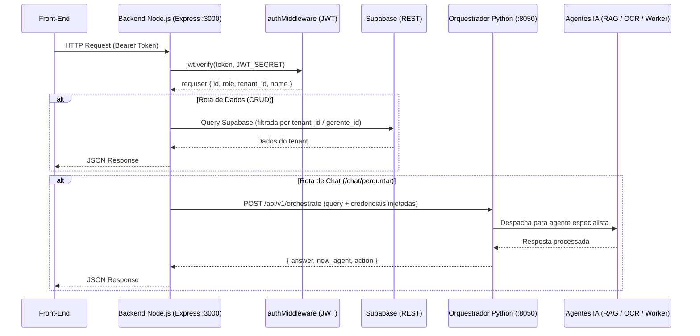

# MindDesk - Backend (API REST Node.js)

Este serviço em Node.js (Express) atua como o **Porteiro e Dispatcher** do ecossistema MindDesk.

A sua responsabilidade é centralizar toda a comunicação entre o Front-End e os demais microsserviços do ecossistema: autenticar usuários, autorizar operações por papel (role), persistir e recuperar dados operacionais no Supabase (atestados, cursos, pontos, férias, PDFs) e despachar as mensagens do chat para o Orquestrador Python. Ele é a única camada que o Front-End enxerga — todos os agentes de IA são chamados de forma transparente, sem exposição ao cliente.

---

## Posição no Ecossistema MindDesk

O Backend Node.js é o ponto de entrada exclusivo para o Front-End. Ele resolve autenticação e autorização localmente (via JWT), serve os dados operacionais direto do Supabase e, para qualquer interação com IA, delega ao Orquestrador Python via HTTP — repassando as credenciais sensíveis no corpo da requisição, sem que o Front-End jamais as manipule.



---

## Arquitetura e Fluxo de Dados (SRP)

O serviço segue a separação em camadas: rotas declaram endpoints e encadeiam middlewares, controllers contêm a lógica de negócio e queries ao Supabase, e services isolam integrações externas. A configuração do banco é compartilhada via singleton.

```text
/
├── server.js                    # Ponto de entrada: registro de rotas e inicialização do Express
├── config/
│   └── supabase.js              # Singleton do cliente Supabase (Service Role Key)
├── middlewares/
│   └── auth.middleware.js       # authMiddleware (JWT) + adminMiddleware (role guard)
├── routes/
│   ├── auth.js                  # Registro, login e troca de senha
│   ├── usuarios.routes.js       # CRUD de funcionários (admin-only)
│   ├── atestados.routes.js      # Upload, listagem e aprovação de atestados
│   ├── pdfs.routes.js           # Upload e gestão de PDFs institucionais
│   ├── pontos.routes.js         # Geração de ticket QR e registro de ponto
│   ├── cursos.routes.js         # Atribuição e conclusão de cursos
│   ├── avisos.routes.js         # Mural de avisos (gerente e funcionário)
│   ├── relatorios.routes.js     # Relatórios analíticos (faltas, férias, banco de horas, PA)
│   └── chat.routes.js           # Ponte para o Orquestrador Python
├── controllers/
│   ├── atestados.controller.js  # Lógica de atestados + fluxo de aprovação RH
│   ├── avisos.controller.js     # Engine de cálculo de situação de férias + mural
│   ├── cursos.controller.js     # Catálogo, atribuição em lote e auditoria de conclusão
│   ├── pdfs.controller.js       # Upload/deleção de PDFs no Storage + tabela relacional
│   ├── pontos.controller.js     # Geração de ticket JWT e registro de ponto via QR
│   ├── relatorios.controller.js # Relatórios de faltas, atrasos, banco de horas, férias, PA
│   └── usuarios_controller.js   # CRUD de usuários com isolamento por gerente_geral
└── services/
    └── ai_service.js            # Proxy HTTP para o Orquestrador Python (Axios)
```

---

## Detalhamento de Módulos e Funções

### 1. Camada de Segurança (`middlewares/auth.middleware.js`)

Dois middlewares compõem o sistema de autorização. Eles são empilhados nas rotas de forma declarativa, tornando a política de acesso visível diretamente na definição da rota.

**`authMiddleware`** — verifica e decodifica o JWT em toda requisição protegida. Injeta o payload completo em `req.user`, disponibilizando `id`, `role`, `tenant_id` e `nome` para todos os controllers downstream sem nova consulta ao banco.

```javascript
const decoded = jwt.verify(token, process.env.JWT_SECRET);
req.user = decoded; // { id, email, role, tenant_id, nome }
```

**`adminMiddleware`** — guard de papel aplicado após `authMiddleware`. Bloqueia qualquer requisição cuja role não seja `admin`, centralizando a lógica de autorização fora dos controllers.

```javascript
function adminMiddleware(req, res, next) {
    if (req.user.role !== 'admin')
        return res.status(403).json({ error: 'Acesso restrito a admins.' });
    next();
}
```

A combinação dos dois é declarada diretamente nas rotas, tornando a política de acesso auto-documentada:

```javascript
router.get('/todos', authMiddleware, adminMiddleware, listarTodosCursos); // admin-only
router.get('/',      authMiddleware, listarCursos);                       // qualquer usuário autenticado
```

### 2. Autenticação (`routes/auth.js`)

Gerencia o ciclo de vida de identidade dos usuários utilizando o Supabase Auth como provedor e JWT próprio como token de sessão — separando autenticação (Supabase) de autorização (JWT local com dados de role e tenant).

**Login:** Valida credenciais no Supabase Auth, enriquece o payload com `role`, `tenant_id` e `nome` da tabela `usuarios`, e emite um JWT de 8 horas com todos os dados necessários para autorização offline em requisições subsequentes.

```javascript
const token = jwt.sign(
    { id, email, role, tenant_id, nome },
    process.env.JWT_SECRET,
    { expiresIn: '8h' }
);
```

**Registro de Admin:** Protegido por dupla barreira (`authMiddleware` + `adminMiddleware`). Apenas admins existentes podem criar novos admins, impedindo escalação de privilégio via registro público.

**Troca de Senha:** Usa `supabase.auth.admin.updateUserById` com o ID extraído do token JWT — sem exigir a senha atual, delegando a prova de identidade ao token já validado pelo middleware.

### 3. Controle de Atestados (`controllers/atestados.controller.js`)

Implementa cinco operações cobrindo o ciclo completo de um atestado médico: upload, listagem com RBAC, aprovação/recusa, fila de pendentes e deleção com limpeza do Storage.

**RBAC na Listagem:** A mesma rota serve gerentes e funcionários com visibilidade diferente. A blindagem ocorre no controller, não no front-end: um funcionário que manipule a URL e passe o `usuario_id` de um colega recebe apenas seus próprios dados.

```javascript
if (!isGerente) {
    query = query.eq('usuario_id', req.user.id); // Força o próprio ID, ignora querystring
} else if (usuario_id) {
    query = query.eq('usuario_id', usuario_id);  // Gerente pode filtrar qualquer subordinado
}
```

**Upload com Sanitização de Nome:** Remove espaços do nome original do arquivo antes do upload no Storage, prevenindo erros de path em sistemas de arquivo e URLs inválidas.

```javascript
const nomeOriginalLimpo = req.file.originalname.replace(/\s+/g, '_');
const nomeArquivo = `${Date.now()}_${nomeOriginalLimpo}`; // Prefixo de timestamp garante unicidade
```

**Deleção Dupla (Storage + Banco):** O `id` do banco é usado para recuperar a URL, o nome do arquivo é extraído da URL para remoção do bucket, e só então o registro relacional é deletado — garantindo que nenhum arquivo órfão permaneça no Storage.

**Fluxo de Aprovação:** Atestados entram com `status: 'pendente'`. O gerente lista via `/pendentes` (com join na tabela `usuarios` para exibir nome e cargo) e aprova ou recusa via `PATCH /:id/status`.

### 4. Engine de Avisos e Situação de Férias (`controllers/avisos.controller.js`)

O coração de inteligência operacional do backend. Calcula em tempo real a situação de férias de cada funcionário baseando-se na CLT, gera avisos priorizados e serve dois murais com perspectivas distintas: um para o gerente (visão da equipe) e um para o funcionário (visão pessoal com linguagem amigável).

**Lógica CLT Blindada (`calcularSituacaoFerias`):** A `data_ferias_prevista` do banco marca o fim do período aquisitivo. O vencimento legal (fim do período concessivo) é calculado como exatamente 12 meses após essa data. A régua de alertas opera sobre os meses decorridos desde o início do ciclo.

```javascript
const dataVencimento = new Date(fimAquisitivo);
dataVencimento.setMonth(dataVencimento.getMonth() + 12); // Vencimento = fim aquisitivo + 12 meses

// Régua de prioridade por meses decorridos desde o início do ciclo:
// ≥ vencimento → 'Crítica'   (férias vencidas, risco de pagamento em dobro)
// ≥ 20 meses  → 'Crítica'   (vencimento iminente, risco de compulsória)
// ≥ 16 meses  → 'Atrasada'  (prazo curto para agendamento)
// ≥ 12 meses  → 'Disponível'
// ≥ 10 meses  → 'Disponível em breve'
// < 10 meses  → null        (sem aviso — não polui o mural)
```

**Mural do Gerente (`listarAvisos`):** Agrega avisos de férias e atestados vigentes da equipe inteira, unificados e ordenados por prioridade. Cada aviso de afastamento mostra dias restantes calculados com normalização de fuso horário (comparação `YYYY-MM-DD` em vez de timestamps brutos) para evitar falsos positivos de expiração.

**Mural do Funcionário (`listarAvisosFuncionario`):** Reutiliza a mesma engine, mas serve linguagem contextualizada ao funcionário (`aviso_funcionario` em vez de `aviso`). Atestados vigentes são exibidos com mensagem de recuperação em vez de alerta operacional.

**Ordenação Unificada:** Ambos os murais aplicam a mesma régua de ordenação: prioridade primeiro (`critica → alta → media → baixa`), desempate por `meses_referencia` decrescente (mais urgente aparece primeiro dentro da mesma faixa).

```javascript
const ordemPrioridade = { critica: 0, alta: 1, media: 2, baixa: 3 };
avisos.sort((a, b) => {
    if (pa !== pb) return pa - pb;
    return (b.meses_referencia || 0) - (a.meses_referencia || 0);
});
```

### 5. Gestão de Cursos (`controllers/cursos.controller.js`)

Suporta dois modos de operação distintos — catálogo (sem atribuição) e atribuição em lote — com auditoria completa de conclusão e rastreabilidade de prazo.

**Inserção Dual (Catálogo vs. Atribuição):** Se nenhum funcionário for selecionado, o curso entra com `usuario_id: null` como item de catálogo. Se funcionários forem selecionados, uma linha é inserida por usuário em batch — mantendo o modelo relacional simples sem tabela de junção.

```javascript
if (!usuarios_ids || usuarios_ids.length === 0) {
    cursosParaInserir.push({ usuario_id: null, ... }); // Catálogo
} else {
    cursosParaInserir = usuarios_ids.map(id => ({ usuario_id: String(id).trim(), ... }));
}
supabase.from('cursos').insert(cursosParaInserir).select(); // Batch único
```

**Deleção em Cascata por Link:** Ao deletar um curso, o sistema remove todos os registros do tenant com o mesmo `link` — eliminando o curso do catálogo e todas as atribuições individuais em uma única operação, sem necessidade de cascata no banco.

**Auditoria de Conclusão (`concluirCurso`):** Ao marcar como concluído, calcula se a entrega foi dentro do prazo (`concluido_no_prazo`) comparando `data_conclusao` com `created_at + prazo_dias`. O registro é gravado em `historico_cursos` para auditoria imutável, e o registro original em `cursos` tem apenas o `status` atualizado para `'concluido'`.

### 6. Controle de Ponto via QR Code (`controllers/pontos.controller.js`)

Implementa um sistema de ponto presencial com prova de identidade via QR Code temporário, eliminando a possibilidade de registro remoto fraudulento.

**Ticket JWT de Vida Curta:** O funcionário solicita um ticket com validade de 1 minuto. Esse ticket é codificado como JWT e exibido como QR Code no dispositivo do funcionário.

```javascript
const ticket = jwt.sign(
    { usuario_id, type: 'ponto' },
    process.env.JWT_SECRET,
    { expiresIn: '1m' } // Janela curta: exige presença física no momento do escaneamento
);
```

**Validação no Registro:** O terminal de ponto decoda o ticket, valida a assinatura e extrai o `usuario_id` — sem depender de nenhum estado de sessão. Um QR Code expirado ou adulterado retorna `401` imediatamente.

### 7. Proxy de IA (`services/ai_service.js`)

Isola toda a comunicação com o Orquestrador Python em um único módulo. O Front-End nunca conhece o endereço do Orquestrador nem manipula as credenciais da OpenAI ou Supabase — elas são injetadas pelo Node.js no momento do despacho.

```javascript
const response = await axios.post(ORQUESTRADOR_URL, {
    query: messageData.query,
    tenant_id: messageData.tenant_id,
    usuario_id: messageData.usuario_id,
    role: messageData.role,
    openai_api_key: process.env.OPENAI_API_KEY,   // Injetado pelo backend — nunca exposto ao FE
    supabase_url: process.env.SUPABASE_URL,
    supabase_key: process.env.SUPABASE_SERVICE_KEY
});
```

### 8. Relatórios Analíticos (`controllers/relatorios.controller.js`)

Cinco endpoints de análise operacional, todos restritos a gerentes autenticados e filtrados pelo `gerente_id` do token — garantindo que cada gerente veja apenas dados de sua equipe direta.

| Endpoint | Fonte de Dados | Lógica Central |
|---|---|---|
| `GET /faltas` | `pontos` | Cruza dias úteis do período com registros de `entrada`; dias sem entrada = falta |
| `GET /atrasos` | `pontos` | Entradas após 08h05 são atrasos; calcula `minutos_atraso` por ocorrência |
| `GET /banco-horas` | `banco_horas` | Lê `saldo_minutos` e formata como `+2h30m` / `-0h45m` com status `positivo/negativo` |
| `GET /ferias` | `ferias` | Aplica `calcularSituacaoFerias` por funcionário; ordena por prioridade CLT |
| `GET /afastamentos` | `atestados` | Filtra atestados vigentes e calcula `data_fim_afastamento` |
| `GET /relatorios-pa` | `people_analytics` | Adiciona `cores` calculadas (verde/amarelo/vermelho) por score sobre os dados brutos |

**People Analytics com Semáforo:** Os scores brutos (burnout, turnover, engajamento, promoção) recebem uma camada de cor calculada em runtime, sem armazenar a cor no banco — permitindo ajustar os limiares sem migração de dados.

```javascript
const calcularCorRisco = (score) => {
    if (score < 50) return 'verde';
    if (score < 80) return 'amarelo';
    return 'vermelho'; // Burnout/Turnover: quanto maior, pior
};
const calcularCorEngajamento = (score) => {
    if (score < 40) return 'vermelho';
    if (score <= 60) return 'amarelo';
    return 'verde'; // Engajamento: quanto maior, melhor
};
```

### 9. CRUD de Usuários (`controllers/usuarios_controller.js`)

Gerencia o ciclo de vida de funcionários com isolamento estrito por `gerente_geral`. Cada admin só enxerga, edita e remove funcionários vinculados ao seu próprio nome — mesmo que manipule parâmetros da requisição.

**Registro com Delay Intencional:** Após o `signUp` no Supabase Auth, há um `setTimeout` de 500ms antes do `update` na tabela `usuarios`. Isso absorve a latência de propagação do trigger de banco que cria o registro do usuário após o Auth — evitando race condition entre a criação no Auth e a atualização do perfil.

```javascript
await supabase.auth.signUp({ email, password });
await new Promise(resolve => setTimeout(resolve, 500)); // Aguarda trigger de criação do perfil
await supabase.from('usuarios').update({ nome, role, cargo, ... }).eq('id', userId);
```

---

## Mapa de Rotas

| Método | Endpoint | Auth | Admin | Descrição |
|--------|----------|------|-------|-----------|
| `POST` | `/auth/register` | ✗ | ✗ | Cria usuário viewer |
| `POST` | `/auth/register/admin` | ✓ | ✓ | Cria usuário admin |
| `POST` | `/auth/login` | ✗ | ✗ | Login e emissão de JWT |
| `PUT` | `/auth/senha` | ✓ | ✗ | Troca de senha |
| `GET` | `/usuarios` | ✓ | ✓ | Lista funcionários do gerente |
| `POST` | `/usuarios/register` | ✓ | ✓ | Cria funcionário |
| `PUT` | `/usuarios` | ✓ | ✓ | Atualiza funcionário por email |
| `DELETE` | `/usuarios` | ✓ | ✓ | Remove funcionário por email |
| `GET` | `/atestados` | ✓ | ✗ | Lista atestados (RBAC automático) |
| `POST` | `/atestados/upload` | ✓ | ✗ | Upload de atestado |
| `DELETE` | `/atestados/:id` | ✓ | ✓ | Remove atestado + arquivo |
| `GET` | `/atestados/pendentes` | ✗ | ✗ | Fila de aprovação |
| `PATCH` | `/atestados/:id/status` | ✗ | ✗ | Aprovar ou recusar |
| `GET` | `/pdfs` | ✓ | ✓ | Lista PDFs institucionais |
| `POST` | `/pdfs/upload` | ✓ | ✓ | Upload de PDF |
| `DELETE` | `/pdfs/:id` | ✓ | ✓ | Remove PDF + arquivo |
| `GET` | `/pontos/ticket` | ✓ | ✗ | Gera ticket JWT para QR Code |
| `POST` | `/pontos/registrar` | ✓ | ✗ | Registra ponto via ticket |
| `GET` | `/pontos` | ✓ | ✗ | Lista pontos do usuário |
| `GET` | `/cursos` | ✓ | ✗ | Lista cursos do funcionário |
| `POST` | `/cursos/:id/concluir` | ✓ | ✗ | Marca curso como concluído |
| `GET` | `/cursos/todos` | ✓ | ✓ | Lista cursos do tenant |
| `POST` | `/cursos` | ✓ | ✓ | Cria/atribui curso |
| `DELETE` | `/cursos/:id` | ✓ | ✓ | Remove curso e atribuições |
| `GET` | `/avisos` | ✓ | ✓ | Mural do gerente |
| `GET` | `/avisos/meus` | ✓ | ✗ | Mural do funcionário |
| `GET` | `/relatorios/faltas` | ✓ | ✓ | Relatório de faltas |
| `GET` | `/relatorios/atrasos` | ✓ | ✓ | Relatório de atrasos |
| `GET` | `/relatorios/banco-horas` | ✓ | ✓ | Relatório de banco de horas |
| `GET` | `/relatorios/ferias` | ✓ | ✓ | Relatório de férias com situação CLT |
| `GET` | `/relatorios/afastamentos` | ✓ | ✓ | Relatório de afastamentos vigentes |
| `GET` | `/relatorios/relatorios-pa` | ✓ | ✓ | People Analytics com semáforo |
| `POST` | `/chat/perguntar` | ✓ | ✗ | Proxy para o Orquestrador Python |

---

## Escalabilidade e Manutenção

1. **Singleton de Conexão (`config/supabase.js`):** O cliente Supabase é instanciado uma única vez com a Service Role Key e compartilhado por todos os controllers via `require`. Diferentemente do Worker Service Python (que instancia o cliente por requisição para suportar multi-tenant dinâmico), aqui o backend opera sempre no mesmo projeto Supabase — isolamento de tenant ocorre via filtros de query (`tenant_id`, `gerente_id`), não via credenciais distintas.

2. **Credenciais Nunca Expostas ao Front-End:** O `ai_service.js` injeta `OPENAI_API_KEY`, `SUPABASE_URL` e `SUPABASE_SERVICE_KEY` em todas as chamadas ao Orquestrador. O Front-End recebe apenas o `answer` final — nunca tem acesso às chaves de serviço, mesmo que inspecione o tráfego de rede entre ele e o Node.js.

3. **Isolamento de Dados por `gerente_id`:** Todos os relatórios e consultas sensíveis filtram pelo `gerente_id` extraído do token JWT — não de parâmetros da requisição. Um gerente não pode acessar dados de outra equipe mesmo adulterando a querystring, pois o filtro determinante é sempre `req.user.id`.

4. **Auditoria Imutável de Cursos:** A tabela `historico_cursos` recebe um insert na conclusão e nunca é atualizada — o status visual vive na tabela `cursos`, mas a evidência de conclusão e conformidade de prazo é preservada independentemente de qualquer edição posterior.

5. **Paridade Arquitetural:** O contrato de saída do `ai_service.js` (`{ answer, new_agent, action }`) é o mesmo lido por todos os agentes Python do ecossistema, garantindo que o Node.js não precise de adaptadores específicos ao adicionar novos agentes — basta registrá-los no Orquestrador.