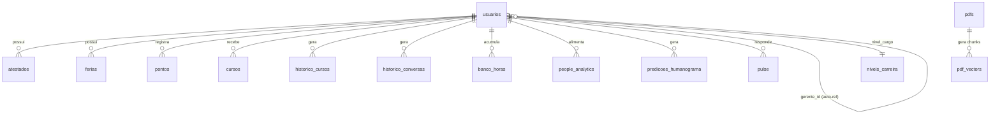

# MindDesk - Schema do Banco de Dados (Supabase / PostgreSQL)

Este documento descreve a **Fundação de Dados** do ecossistema MindDesk.

A sua responsabilidade é centralizar o modelo relacional completo que sustenta todos os microsserviços da plataforma: autenticação, operações de RH (atestados, férias, pontos, cursos), inteligência vetorial para o Agente RAG e analytics comportamental de People Analytics. Cada tabela possui responsabilidade singular e isolamento de dados por `tenant_id`, garantindo a segregação entre empresas clientes na arquitetura multi-tenant.

---

## Posição no Ecossistema MindDesk

O banco de dados é o único componente compartilhado entre todos os microsserviços. O Backend Node.js lê e escreve os dados operacionais. O Worker Service grava os vetores gerados. O Agente RAG consulta os vetores via RPC. O Orquestrador e seus agentes especializados leem o histórico de conversas para manter contexto entre sessões.



---

## Arquitetura e Domínios de Dados

O schema foi segmentado em quatro domínios funcionais distintos, cada um servindo um conjunto específico de microsserviços.

```text
Supabase (PostgreSQL + pgvector)
├── Identidade e Estrutura Organizacional
│   ├── usuarios              # Perfis vinculados ao Supabase Auth (auth.users)
│   └── niveis_carreira       # Tabela de referência para progressão de carreira
│
├── Operações de RH
│   ├── atestados             # Documentos médicos com fluxo de aprovação
│   ├── ferias                # Períodos aquisitivos e concessivos por funcionário
│   ├── legado_ferias         # Registros históricos do modelo anterior de férias
│   ├── pontos                # Registros de entrada/saída via QR Code
│   ├── new_pontos            # Tabela de migração/substituição de pontos
│   ├── banco_horas           # Saldo consolidado de horas extras e débitos
│   └── cursos                # Catálogo e atribuições de treinamentos
│
├── Auditoria e Historico
│   ├── historico_cursos      # Registro imutável de conclusões com conformidade de prazo
│   ├── historico_conversas   # Memória de sessão dos agentes de IA por usuário
│   └── historico_promocoes   # Trilha de progressão de carreira por funcionário
│
├── Inteligencia Artificial
│   ├── pdfs                  # Metadados dos documentos institucionais
│   ├── pdf_vectors           # Chunks vetorizados para busca semântica (pgvector)
│   ├── people_analytics      # Scores comportamentais gerados por IA mensalmente
│   ├── predicoes_humanograma # Predições de turnover, burnout e promoção por funcionário
│   └── pulse                 # Snapshot de humor e sentimento do funcionário
```

---

## Detalhamento de Tabelas por Dominio

### 1. Identidade e Estrutura Organizacional

**`usuarios`**

Tabela central do ecossistema. Cada registro é criado automaticamente via trigger do Supabase Auth ao realizar o `signUp`, sendo depois enriquecido pelo backend com `nome`, `role`, `cargo` e vínculos organizacionais. O campo `gerente_id` é uma auto-referência que forma a hierarquia de equipes sem necessidade de tabela separada.

```sql
CREATE TABLE public.usuarios (
  id uuid NOT NULL,                        -- Espelha auth.users.id (FK obrigatória)
  nome text,
  email text,
  role text DEFAULT 'viewer',             -- 'admin' | 'viewer'
  cargo text,
  data_contratacao date,
  tenant_id integer DEFAULT 1,            -- Isolamento multi-tenant
  gerente_id uuid,                        -- Auto-referência: quem é o gerente deste usuário
  gerente_geral text,                     -- Nome do gerente (usado como filtro nos controllers)
  nivel_cargo integer DEFAULT 3,          -- FK para niveis_carreira
  saldo_ferias integer DEFAULT 30,
  CONSTRAINT usuarios_id_fkey FOREIGN KEY (id) REFERENCES auth.users(id)
);
```

O campo `gerente_geral` (nome em texto) coexiste com `gerente_id` (UUID) por razão de compatibilidade: queries de isolamento nos controllers usam `gerente_geral` como filtro de texto, enquanto `gerente_id` serve para joins relacionais e futuras migrações.

**`niveis_carreira`**

Tabela de referência com os níveis de progressão disponíveis no tenant. Usada como constraint de integridade no campo `nivel_cargo` de `usuarios`, garantindo que nenhum funcionário seja atribuído a um nível inexistente.

---

### 2. Operacoes de RH

**`atestados`**

Registra o ciclo completo de um atestado médico: do upload ao status final. O campo `status` controla o fluxo de aprovação do RH e é a fonte primária para os avisos de afastamento no mural do gerente.

```sql
CREATE TABLE public.atestados (
  id integer NOT NULL DEFAULT nextval('atestados_id_seq'),
  tenant_id integer NOT NULL,
  usuario_id uuid,                        -- FK para usuarios
  data_emissao date NOT NULL,
  dias_afastamento integer NOT NULL,
  motivo_cid text,                        -- Código CID-10 extraído pelo Agente OCR
  url_arquivo text,                       -- URL pública no Supabase Storage
  status text DEFAULT 'em_analise'        -- 'em_analise' | 'aprovado' | 'recusado'
);
```

O `motivo_cid` é preenchido pelo Agente OCR após extração visual do documento. O `url_arquivo` aponta para o bucket `atestados` no Supabase Storage — a deleção do registro deve sempre ser acompanhada da remoção do arquivo no bucket.

**`ferias`**

Modelo de periodo aquisitivo e concessivo conforme CLT. O campo `data_ferias_prevista` marca o fim do período aquisitivo e é a entrada principal da engine de cálculo de situação de férias no backend. O vencimento legal é calculado em runtime como `data_ferias_prevista + 12 meses`.

```sql
CREATE TABLE public.ferias (
  id integer NOT NULL,
  usuario_id uuid NOT NULL,
  tenant_id integer NOT NULL,
  data_ferias_prevista date NOT NULL,     -- Fim do período aquisitivo (base do cálculo CLT)
  status_ferias text NOT NULL             -- CHECK: 'pendente' | 'cumprida'
    CHECK (status_ferias = ANY (ARRAY['pendente', 'cumprida'])),
  data_inicio date,                       -- Preenchido ao agendar as férias
  data_fim date                           -- Preenchido ao agendar as férias
);
```

A engine de alertas no backend opera exclusivamente sobre registros com `status_ferias = 'pendente'`. Após o gozo, o registro é marcado como `'cumprida'` e entra no cálculo de histórico de férias.

**`pontos`**

Registra cada batida de ponto de entrada ou saída. O registro é criado via validação de ticket JWT de vida curta (1 minuto), gerado pelo backend no momento em que o funcionário abre o QR Code — garantindo que o registro represente presença física.

```sql
CREATE TABLE public.pontos (
  id integer NOT NULL,
  tenant_id integer NOT NULL,
  usuario_id uuid NOT NULL,
  horario timestamp with time zone NOT NULL DEFAULT now(),
  tipo text,                              -- 'entrada' | 'saida'
  observacao text
);
```

Os relatórios de faltas e atrasos são calculados em runtime pelo backend cruzando os registros desta tabela com os dias úteis do período solicitado. A tabela `new_pontos` possui estrutura idêntica e está em uso como destino de migração.

**`banco_horas`**

Mantém o saldo consolidado de horas por funcionário. A tabela armazena o resultado calculado (`saldo_minutos`) em vez das marcações brutas, permitindo leitura direta pelo relatório de banco de horas sem processamento adicional. Saldos negativos representam débito de horas.

```sql
CREATE TABLE public.banco_horas (
  id integer NOT NULL,
  usuario_id uuid NOT NULL UNIQUE,        -- Um registro por funcionário
  tenant_id integer NOT NULL,
  saldo_minutos integer NOT NULL DEFAULT 0,  -- Positivo = crédito | Negativo = débito
  updated_at timestamp with time zone DEFAULT now()
);
```

**`cursos`**

Suporta dois modos de operação: catálogo (`usuario_id = null`) e atribuição individual (`usuario_id` preenchido). Uma linha por funcionário por curso atribuído. A deleção remove pelo `link` do curso, eliminando o catálogo e todas as atribuições em uma operação.

```sql
CREATE TABLE public.cursos (
  id integer NOT NULL,
  tenant_id integer,
  usuario_id uuid,                        -- null = catálogo | uuid = atribuição individual
  titulo text NOT NULL,
  link text NOT NULL,                     -- Chave de deleção em cascata (mesmo link = mesmo curso)
  criado_por uuid,                        -- FK para usuarios (gerente que criou)
  status text,                            -- 'pendente' | 'concluido'
  prazo_dias integer                      -- Dias a partir de created_at para conclusão
);
```

---

### 3. Auditoria e Historico

**`historico_cursos`**

Registro imutável de cada conclusão de curso. Nunca é atualizado após o insert — o status visual vive na tabela `cursos`, mas a evidência de conformidade de prazo é preservada aqui independentemente de qualquer edição posterior.

```sql
CREATE TABLE public.historico_cursos (
  id uuid NOT NULL DEFAULT gen_random_uuid(),
  tenant_id integer NOT NULL,
  usuario_id uuid NOT NULL,
  nome_curso character varying NOT NULL,
  obrigatorio boolean DEFAULT false,
  prazo_limite date,                      -- created_at + prazo_dias calculado no momento da conclusão
  data_conclusao date NOT NULL,
  concluido_no_prazo boolean DEFAULT true -- Calculado pelo backend no momento do insert
);
```

**`historico_conversas`**

Memória persistente dos agentes de IA. Cada mensagem (do usuário e do assistente) é gravada com `role` e `content`, permitindo que o Orquestrador recupere o histórico recente e mantenha coerência de contexto entre sessões distintas.

```sql
CREATE TABLE public.historico_conversas (
  id integer NOT NULL,
  tenant_id integer NOT NULL,
  usuario_id uuid,
  role text NOT NULL,                     -- 'user' | 'assistant'
  content text NOT NULL,
  created_at timestamp with time zone DEFAULT now()
);
```

**`historico_promocoes`**

Trilha de auditoria de progressão de carreira. Registra cada alteração de cargo com o estado anterior e posterior, formando o histórico de promoções que alimenta o score de elegibilidade do People Analytics.

---

### 4. Inteligencia Artificial

**`pdfs` e `pdf_vectors`**

Duas tabelas formam a base do Agente RAG. A tabela `pdfs` armazena os metadados do documento. A tabela `pdf_vectors` armazena os chunks vetorizados gerados pelo Worker Service, usando o tipo `vector` do pgvector para buscas de similaridade via RPC.

```sql
CREATE TABLE public.pdfs (
  id uuid NOT NULL DEFAULT gen_random_uuid(),
  tenant_id integer NOT NULL,
  nome text,
  url text,                               -- URL pública no Supabase Storage
  criado_em timestamp without time zone DEFAULT now()
);

CREATE TABLE public.pdf_vectors (
  id uuid NOT NULL DEFAULT gen_random_uuid(),
  pdf_id bigint NOT NULL,                 -- Referência ao documento de origem (traceability)
  tenant_id bigint NOT NULL,              -- Filtro de segurança na RPC match_pdf_vectors
  chunk_text text NOT NULL,
  embedding USER-DEFINED NOT NULL,        -- Tipo vector do pgvector (384 dimensões, GTE-Small)
  chunk_index integer NOT NULL,           -- Posição do chunk no documento original
  embedding_model_used text               -- Auditoria de versão do modelo ('gte-small')
);
```

O campo `embedding_model_used` em `pdf_vectors` permite identificar registros gerados por modelos anteriores em futuras migrações, sem necessidade de reprocessar toda a base vetorial.

**`people_analytics`**

Snapshot mensal de indicadores comportamentais e de performance por funcionário, gerado por agente de IA. Concentra métricas brutas (faltas, atrasos, horas extras) e scores calculados (burnout, turnover, engajamento, elegibilidade de promoção) no mesmo registro, otimizando a leitura pelo relatório de People Analytics.

```sql
-- Campos de metricas brutas (alimentados pelo sistema operacional)
faltas_ultimo_mes integer,
qtd_atrasos_ultimo_mes integer,
horas_extras_ultimo_mes numeric,
ausencias_atestado_ultimo_mes integer,
cursos_obg_vencidos integer,
cursos_obg_no_prazo integer,

-- Scores gerados por IA (0-100)
score_burnout integer,
score_turnover integer,
score_engajamento integer,
score_elegibilidade_promocao integer,

-- Posicionamento relativo na equipe
posicao_burnout text,
posicao_turnover text,

-- Analise qualitativa gerada por LLM
analise_pa text,
sentimento_predominante text,
mes_referencia text                       -- Formato 'YYYY-MM' para filtro temporal
```

As cores de semáforo (verde/amarelo/vermelho) exibidas no front-end não são armazenadas no banco — são calculadas em runtime pelo backend sobre os scores brutos, permitindo ajuste dos limiares sem migração de dados.

**`predicoes_humanograma`**

Um registro por funcionário (constraint `UNIQUE` em `usuario_id`), atualizado via upsert pelo agente de People Analytics. Centraliza as predições de risco e recomendação de ação para o humanograma da empresa.

**`pulse`**

Snapshot de humor e sentimento do funcionário, também com constraint `UNIQUE` por `usuario_id`. Atualizado periodicamente com base em interações e análise de sentimento pelo agente de IA.

---

## Escalabilidade e Manutencao

1. **Isolamento Multi-Tenant por Coluna:** O `tenant_id` presente em todas as tabelas operacionais é o mecanismo primário de isolamento entre empresas clientes. Diferentemente de schemas separados por tenant, essa abordagem permite escalar horizontalmente sem multiplicar objetos de banco — o custo é a obrigatoriedade de incluir o filtro `tenant_id` em toda query.

2. **Delegacao de Autenticacao ao Supabase Auth:** A tabela `usuarios` não armazena senhas. A constraint `FOREIGN KEY (id) REFERENCES auth.users(id)` vincula cada perfil ao sistema de autenticação nativo do Supabase, delegando hashing, reset de senha e gerenciamento de sessões para a camada de Auth gerenciada.

3. **Separacao entre Dado Operacional e Dado Calculado:** Tabelas como `banco_horas`, `pulse` e `predicoes_humanograma` armazenam resultados calculados em vez de eventos brutos. Isso inverte o custo computacional: a escrita é mais cara (requer processamento), mas a leitura é direta — adequado para dados consultados frequentemente pelo front-end e com atualização periódica por agentes assíncronos.

4. **Auditoria Imutavel em Tabelas Separadas:** `historico_cursos` e `historico_promocoes` usam `uuid` gerado por `gen_random_uuid()` como chave primária e nunca recebem `UPDATE`. Isso os diferencia das tabelas operacionais (com `integer` sequencial) e sinaliza ao desenvolvedor que esses registros são evidências de auditoria, não estado mutável.

5. **Compatibilidade Vetorial entre Servicos:** O tipo `vector` em `pdf_vectors` exige que o Worker Service (que grava os embeddings) e o Agente RAG (que consulta por similaridade) usem obrigatoriamente o mesmo modelo de embedding. A coluna `embedding_model_used` registra qual modelo gerou cada chunk, tornando auditável qualquer divergência futura e permitindo re-vetorização seletiva sem reconstruir toda a base.