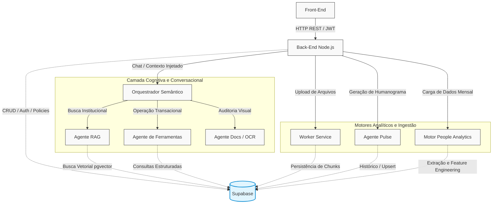

# MindDesk - Ecossistema Corporativo e Cognitivo de RH

O MindDesk é uma plataforma corporativa projetada para centralizar e automatizar a gestão de Recursos Humanos e o suporte operacional aos colaboradores. A solução atua diretamente sobre a fragmentação de dados organizacionais e o gargalo do atendimento interno, combinando um sistema transacional estruturado com uma camada cognitiva avançada. O diferencial estratégico da arquitetura reside na integração de Inteligência Artificial distribuída: um barramento de agentes especialistas capazes de interpretar normas institucionais, auditar documentos médicos e executar operações via linguagem natural, operando de forma paralela com motores analíticos contínuos (People Analytics e Pulse). Estes motores transformam o histórico de operações e interações em indicadores preditivos de engajamento, risco de turnover, burnout e saúde ocupacional.

## Arquitetura e Fluxo de Dados

A topologia orientada a microsserviços garante responsabilidade única (SRP), isolamento de falhas e escalabilidade independente por domínio de negócio. O Back-End atua como o ponto de entrada blindado para o Front-End, resolvendo autenticação e autorização localmente. A partir dele, as requisições fluem para a camada de persistência corporativa ou são despachadas via HTTP assíncrono para o ecossistema de inteligência em Python.



## Resumo dos Componentes

O ecossistema opera sob uma política estrita de segurança e isolamento por tenant, composto pelos seguintes serviços:

* **Back-End (API REST Node.js):** Ponto de entrada exclusivo. Centraliza o controle de acesso (RBAC e JWT), isola a lógica multitenant e gerencia operações de CRUD no banco. Oculta chaves de API e roteia solicitações de IA para o Orquestrador, atuando como um API Gateway interno.
* **Orquestrador Semântico (Python/FastAPI):** Controlador central de conversação. Intercepta requisições de chat, classifica a intenção do usuário utilizando modelos de linguagem e mantém o estado lógico do fluxo, roteando o payload para o especialista adequado.
* **Agente RAG (Retrieval-Augmented Generation):** Bibliotecário especialista. Realiza buscas semânticas em bases vetoriais utilizando o modelo GTE-Small. Evita alucinações ao redigir respostas ancoradas estritamente nos chunks de PDFs institucionais retornados pelo banco.
* **Agente de Ferramentas (Tools Agent):** Especialista transacional. Utiliza a funcionalidade de Function Calling para converter intenções de linguagem natural em chamadas e consultas estruturadas de banco de dados (ex: consultar saldo de férias, validar atestados).
* **Agente de Documentos e OCR (Docs Agent):** Auditor visual. Processa imagens de documentos médicos enviados via upload utilizando visão computacional. Extrai informações clínicas de forma determinística e estruturada (médico, CRM, CID, datas) para validação antes da persistência.
* **Worker Service (Ingestão de PDFs):** Esteireiro de conhecimento. Serviço bloqueante que executa o pipeline de ingestão de documentos: download remoto, limpeza, chunking semântico com overlap, vetorização matemática e persistência na base pgvector.
* **Agente Pulse (Humanograma):** Psicólogo organizacional. Executa rotinas em background para analisar o histórico de conversas, identificando padrões emocionais e calculando scores de humor para composição de mapas de clima organizacional.
* **Motor de People Analytics:** Analista organizacional. Consolida registros fragmentados em uma Feature Matrix por colaborador. Calcula scores heurísticos de risco corporativo (Burnout, Turnover) e aciona inteligência generativa para redigir sumários gerenciais.

## Estrutura de Banco de Dados

O repositório inclui um diretório de referência denominado `MD_db` na raiz do projeto. Esta pasta contém a documentação da estrutura geral do banco de dados, bem como um arquivo SQL de referência. Este material deve ser utilizado para consulta de relacionamentos, tipos de dados e recriação dos esquemas (schemas) necessários no Supabase.

## Como Executar o Projeto Localmente

A orquestração local dos serviços de backend e agentes é feita de forma automatizada via containers, garantindo paridade entre os ambientes de desenvolvimento e produção.

### 1. Configuração de Variáveis de Ambiente
Antes de iniciar os serviços, é necessário configurar as credenciais de acesso ao banco de dados e as chaves de segurança. Na raiz do projeto (onde se encontra o arquivo do backend e o docker-compose), crie um arquivo chamado `.env` e defina as seguintes variáveis obrigatórias:

```env
SUPABASE_URL="sua_url_do_supabase_aqui"
SUPABASE_KEY="sua_service_role_key_do_supabase_aqui"
JWT_SECRET="sua_chave_secreta_jwt_aqui"
PORT=3000
```
Nota: Recomendamos manter a variável `PORT` configurada para `3000`, assegurando o roteamento correto com as chamadas nativas do Front-End.

### 2. Inicialização dos Microsserviços e Back-End
Com o arquivo `.env` configurado, inicie o cluster de serviços através do Docker na raiz do projeto:

```bash
docker compose up --build
```
Este comando fará o provisionamento do Back-End em Node.js, instalará as dependências de todos os microsserviços em Python e fará o pre-download dos modelos de IA necessários, expondo as portas designadas.

### 3. Inicialização do Front-End
O Front-End é executado de forma independente em ambiente de desenvolvimento. Em um novo terminal, acesse o diretório da aplicação cliente e inicie o servidor:

```bash
cd frontend
npm install
npm run dev
```

A interface estará disponível no endereço local exibido no terminal (geralmente `http://localhost:5173`) e integrada ao Back-End operando na porta 3000.